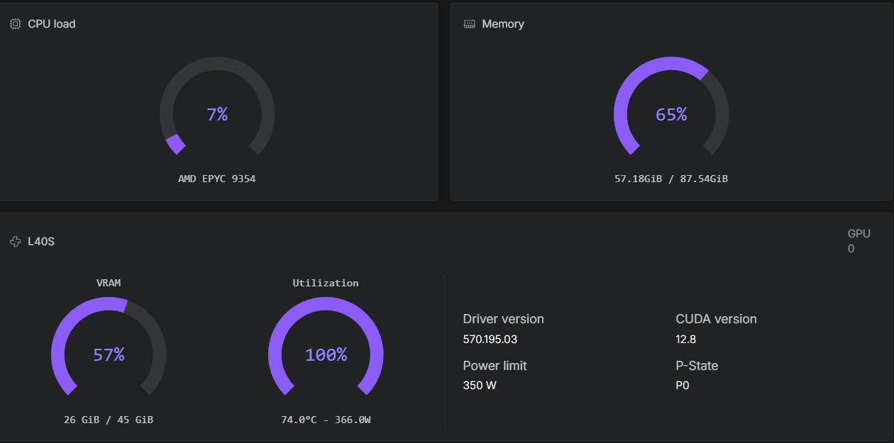

# LTX-2 inference with ComfyUI 

A streamlined and automated environment for running **ComfyUI** with **LTX-2 video models**, optimized for use on RunPod

## 🔧 Features

- Automatic model and LoRA provisioning via environment variables or lora-manager.
- Supports advanced workflows for **video generation** and **enhancement** using pre-installed custom nodes.
- Compatible with high-performance NVIDIA GPUs (CUDA 12.8).
- Compiled attentions and GPU accelerations.
- Loads models/workflows dependent on available VRAM (see Hardware requirements).
- Latent preview enabled for both samplers.
- Based on Kijai's workflow.
- i2v and t2v.

## 🔧 Built-in **authentication**
  
- ComfyUI
- Code Server
- Hugging Face API
- CivitAI API

## 📦 Deployment on runpod

- [👉 Templates](ComfyUI_LTX_deployment.md)

