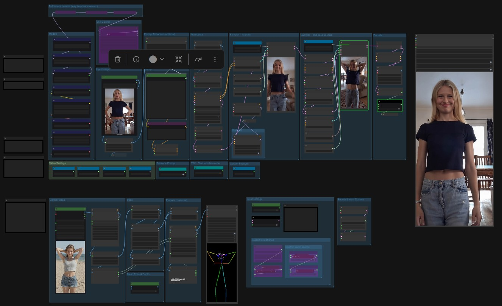
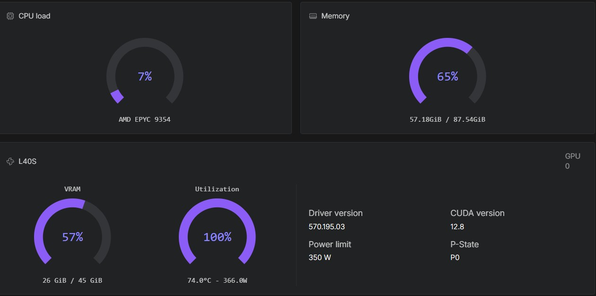
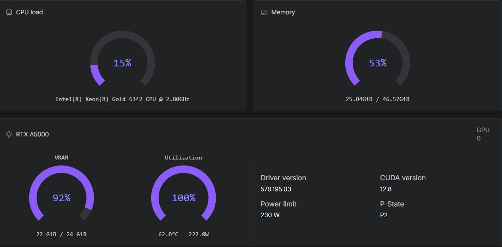
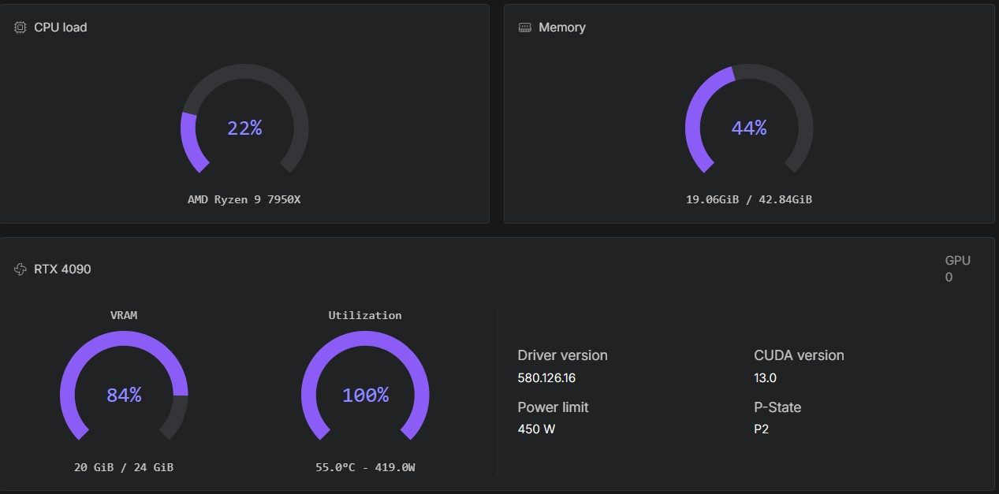

# LTX 2.3 inference with ComfyUI

A streamlined and automated environment for running **ComfyUI** with **LTX-2.3 video models**, optimized for use on RunPod

## Example included workflows

### i2v

### iv2v

## 🔧 Features

- Automatic model and LoRA provisioning via environment variables.
- [Kajai models no checkpoint](https://huggingface.co/Kijai/LTX2.3_comfy) 
- Included workflows for **video generation** and **enhancement** using pre-installed custom nodes.
- Compatible with high-performance NVIDIA GPUs (CUDA 12.8).
- Compiled attentions and GPU accelerations.
- Automatic selecting bf16 or fp8 models/workflows.
- Latent preview enabled for both samplers.
- Included worflows based on [RuneXX](https://huggingface.co/RuneXX/LTX-2.3-Workflows)
- Lora manager

## 🔧 Built-in **authentication**
  
- ComfyUI
- Code Server
- Hugging Face API
- CivitAI API

## 📦 Deployment on runpod

- [👉 Templates](ComfyUI_LTX_deployment.md)

## 📘 Tutorial

- [Specific for this template](ComfyUI_LTX_tutorial.md)

### Pod running on L40S bf16

### Pod running on RTX A5000 fp8

### Pod running on RTX 4090 fp8

