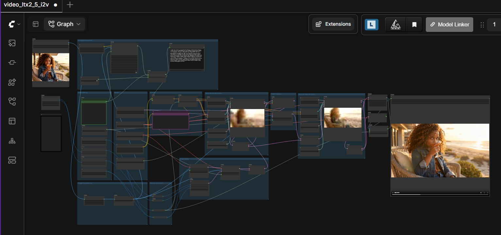
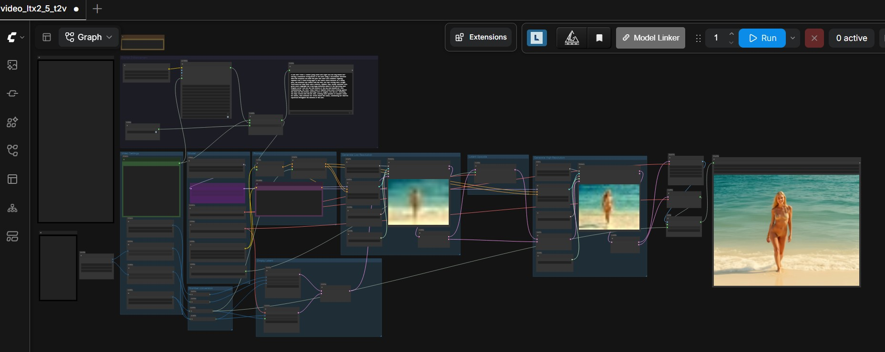
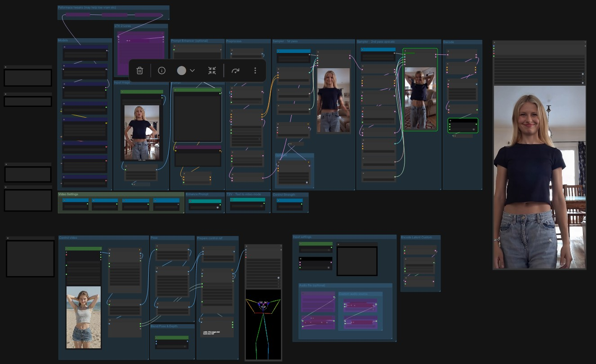
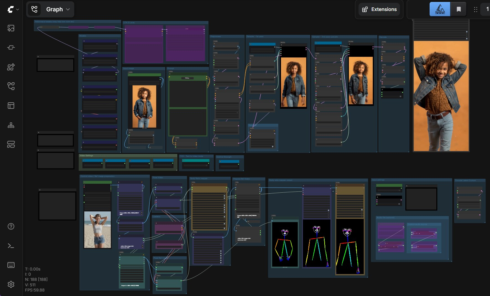
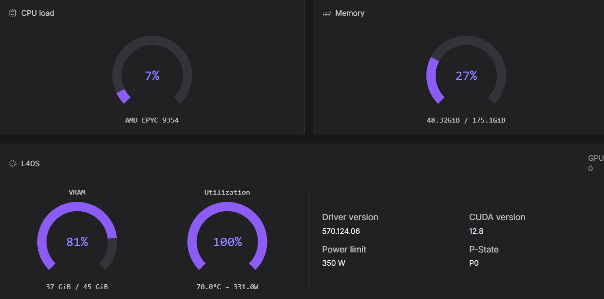
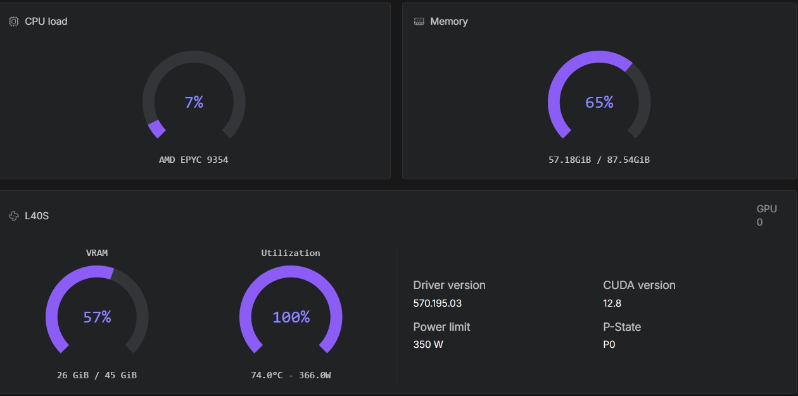
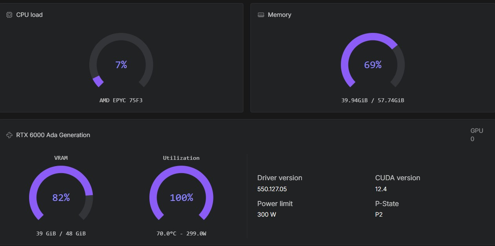
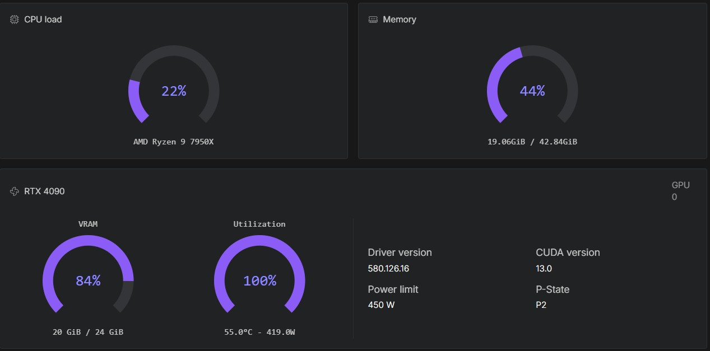

# LTX 2.x inference with ComfyUI

A streamlined and automated environment for running **ComfyUI** with **LTX-2.x video models**, optimized for use on RunPod.

## What to expect

These templates are intended for users who already want to run ComfyUI on RunPod and are comfortable following technical setup steps. No Linux expertise is required for normal use, but basic familiarity with RunPod pods, logs, tokens, and file management is helpful.

## When to use this template

Use this template for LTX 2.x video generation, image-to-video, video-to-video, pose-transfer, camera-motion transfer, and audio/reference workflows.

## Purpose of this pod

This pod is designed as an experimental ComfyUI environment for image creators who want maximum creative freedom. It focuses on integrating image models, editing models, LoRAs, and custom nodes that reduce unnecessary workflow restrictions and make it easier to test open, flexible, and uncensored creative pipelines.

The guiding idea is aligned with the open-model discussion described by Eric Hartford in [Uncensored Models](https://erichartford.com/uncensored-models): local and open AI systems should give advanced users more ownership, control, and composability. In this context, the pod is not a safety policy or content platform. It is a technical workspace for responsible users who want to explore creative image generation, image editing, prompt enhancement, captioning, and model combinations with as much artistic latitude as the available models and custom nodes allow.

## 🔧 Features

- Complete LTX-2.x chain
- ComfyUI int8-convrot transformer selection.
- Community Heretic BF16 and int8-convrot text encoder profiles by GPU VRAM.
- Video and audio VAEs, spatial and temporal latent upscalers, and duration
  head patch.
- CUDA 12.8 runtime with compiled attention and GPU acceleration packages.
- ComfyUI, Code Server, SSH, LoRA Manager, Hugging Face, and CivitAI support.

## 🔧 Built-in **authentication**
  
- ComfyUI
- Code Server
- Hugging Face API
- CivitAI API

## 📦 Deployment on RunPod

- [👉 Templates](ComfyUI_LTX_deployment.md)

## 📘 Tutorial

- [Specific for this template](ComfyUI_tutorial.md)

## Example included workflows

### LTX 25 i2v

### LTX 25 t2v

### LTX 23 vi2v pose transfer DWPose

### LTX 23 vi2v pose transfer SDPose (Body Ratio Mapper)

### i2v LTX25

  <video controls preload="metadata" style="max-width: 50%; height: auto;">
    <source src="/video/Video_girl_drinking_cocktail_LTX25.mp4" type="video/mp4">
  </video>

### t2v LTX25

  <video controls preload="metadata" style="max-width: 50%; height: auto;">
    <source src="/video/Video_girl_walking_on_beach_LTX25.mp4" type="video/mp4">
  </video>

### LTX 25 Pod running on L40S INT8 convrot

### LTX 23 Pod running on L40S bf16 

### LTX 23 Pod running on RTX 6000 Ada bf16

### LTX 23 Pod running on RTX A5000 fp8

### LTX23 Pod running on RTX 4090 fp8

## More information

- [Environment configuration](RunPod_configuration.md)
- [Hardware guidance](ComfyUI_LTX_hardware.md)
- [Image setup](ComfyUI_LTX_image_setup.md)
- [Custom nodes](ComfyUI_LTX_custom_nodes.md)
- [Resources](ComfyUI_LTX_resources.md)
- [Updates](ComfyUI_LTX_update.md)
