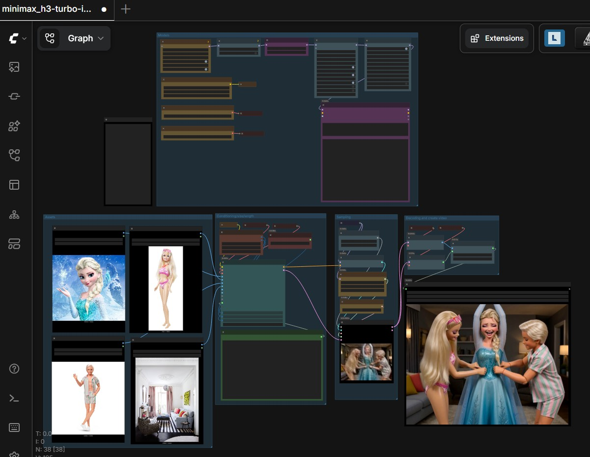
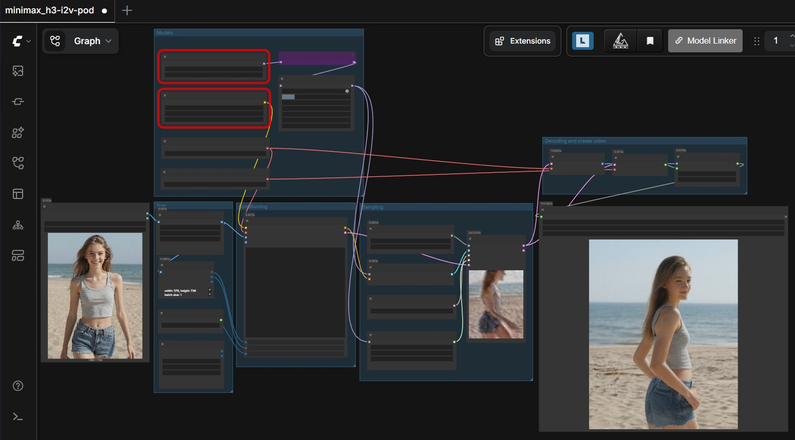
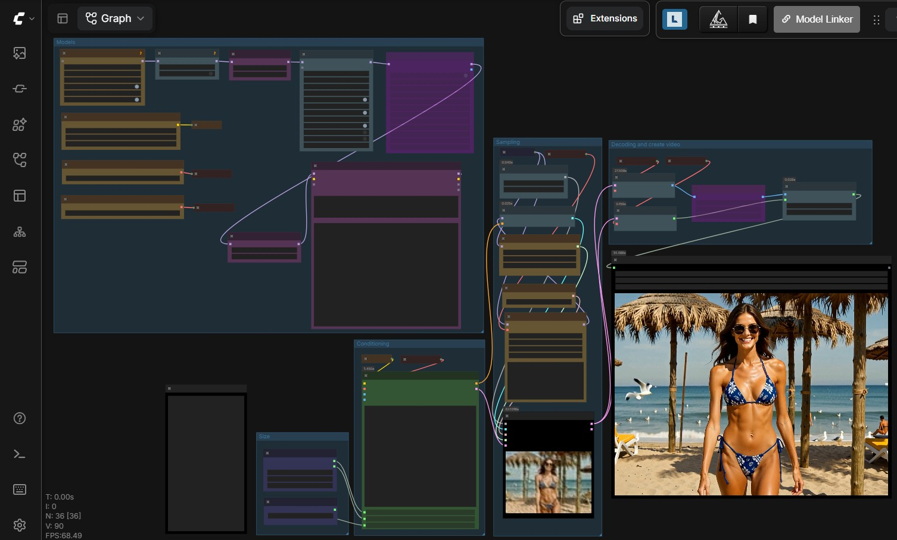
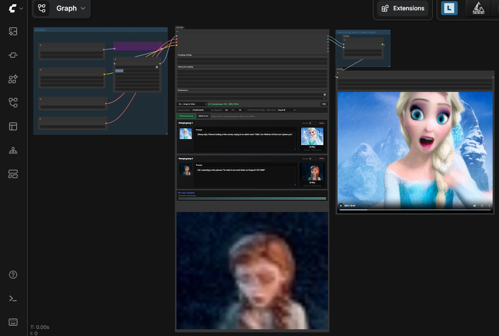
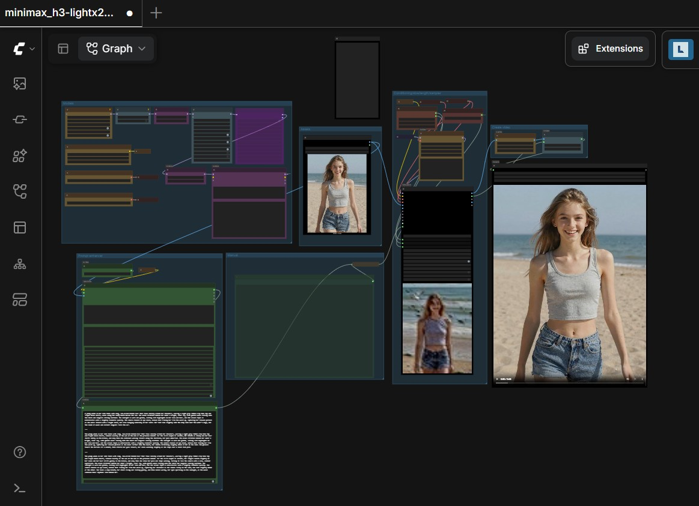
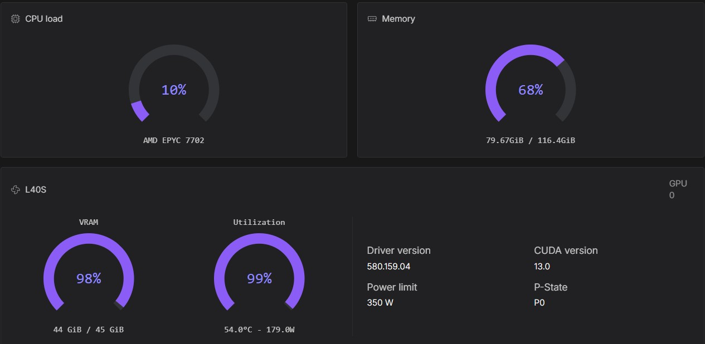
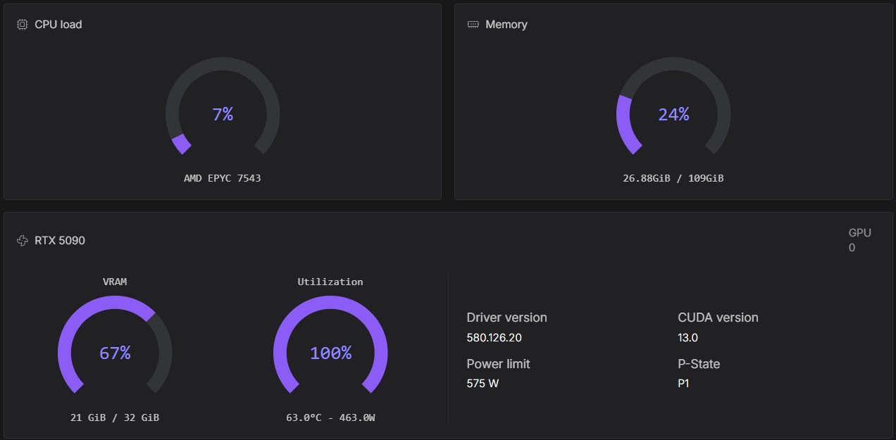
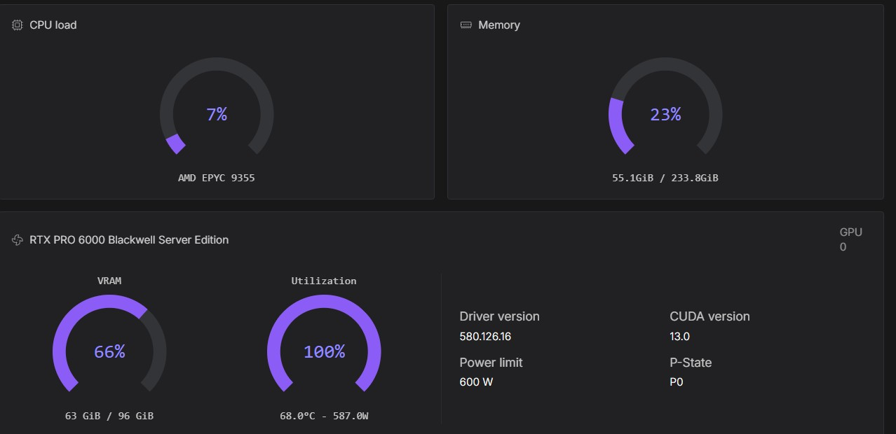
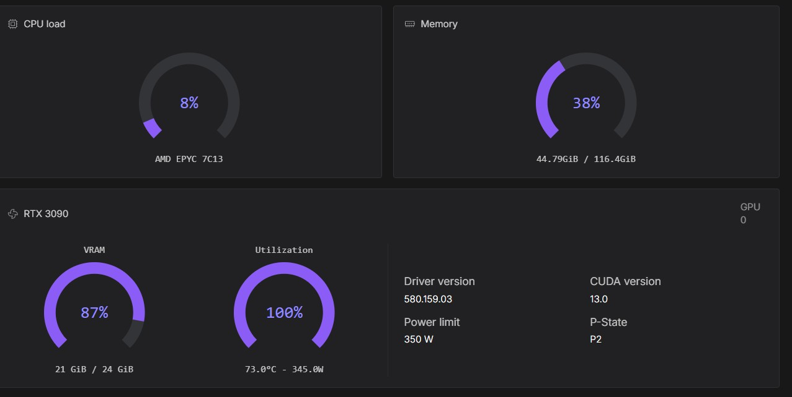

# MiniMax inference with ComfyUI

A streamlined and automated environment for running **ComfyUI** with **MiniMax H3 video and native-audio generation**, optimized for RunPod.

## What to expect

The template provisions the official ComfyUI MiniMax H3 model repacks, VAEs and workflows. Basic familiarity with RunPod pods, logs, secrets and file management is useful; normal use does not require Linux administration experience.

## When to use this template

Use this template for MiniMax H3 text-to-video, image-to-video, first/last-frame video and reference-to-video workflows with generated audio.

## 🔧 Features

- Automatic model provisioning through environment variables.
- Models downloads depending on VRAM and architecture (Ada Lovelace / Blackwell).
- CUDA 12.8 runtime with compiled attention acceleration.
- Authentication for ComfyUI, Code Server, Hugging Face and CivitAI.
- Uncensored heretic QWEN VL text encoder.
- LoRA Manager
- Installed custom nodes and accelerators.
- Example workflows.
- 4-step , 8-step Turbo-loras (turbo and lightx2v) included

## 📦 Deployment on RunPod

- [RunPod deployment](ComfyUI_MiniMax_deployment.md)

## 📘 Tutorial

- [MiniMax tutorial](ComfyUI_tutorial.md)

## Example standard workflow Reference to video/audio (Ref2va) with or without turbo

## Example standard workflow image to video/audio (fl2va) with or without turbo

 with or without turbo

## Example standard workflow text to video/audio (fl2va) with or without turbo

## Example workflow all in one with or without turbo

## Example experimental workflow with 3 x 15 seconds multi-shot from one reference image (Ref2va)

## Example video with Ref2va

  <video controls preload="metadata" style="max-width: 50%; height: auto;">
    <source src="/video/Video_tickling_princess.mp4" type="video/mp4">
  </video>

## Example video with fl2va

### i2v

  <video controls preload="metadata" style="max-width: 50%; height: auto;">
    <source src="/video/Video_girl_drinking_cocktail.mp4" type="video/mp4">
  </video>

### t2v

  <video controls preload="metadata" style="max-width: 50%; height: auto;">
    <source src="/video/Video_girl_walking_on_beach.mp4" type="video/mp4">
  </video>

## Example video with director

  <video controls preload="metadata" style="max-width: 50%; height: auto;">
    <source src="/video/Video_minimax_slow.mp4" type="video/mp4">
  </video>

## Example video multi-shot (45 seconds video generated on RTX 5090)

  <video controls preload="metadata" style="max-width: 50%; height: auto;">
    <source src="/video/Video_minimax_multi-shot.mp4" type="video/mp4">
  </video>

### Pod running on L40S (good quality)

### Pod running on RTX 5090 (fast but restricted in resolution and duration)

### Pod running on RTX PRO 6000 (fast and no restrictions)

### Pod running on RTX 3090/4090 (slow and restricted in resolution and duration)

## More information

- [Environment configuration](RunPod_configuration.md)
- [Hardware guidance](ComfyUI_MiniMax_hardware.md)
- [Image setup](ComfyUI_MiniMax_image_setup.md)
- [Custom nodes](ComfyUI_MiniMax_custom_nodes.md)
- [Resources](ComfyUI_MiniMax_resources.md)
- [Updates](ComfyUI_MiniMax_update.md)
