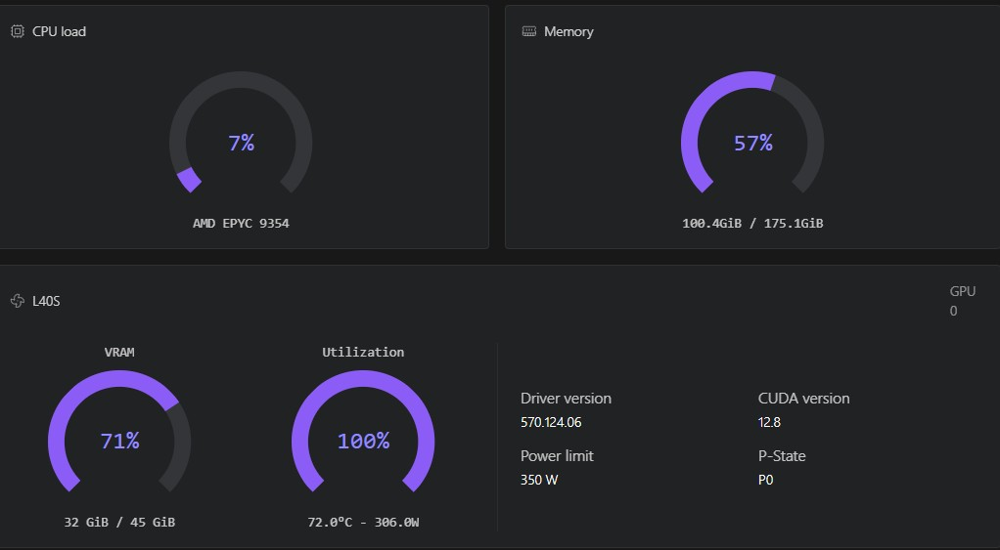

# WAN 2.x inference with ComfyUI 

A streamlined and automated environment for running **ComfyUI** with **WAN 2.x video models**, optimized for use on RunPod

## 🔧 Features

- Automatic model and LoRA downloads via environment variables.
- Supports advanced workflows for **video generation** and **enhancement** using pre-installed custom nodes
- Compatible with high-performance NVIDIA GPUs

## 🔧 Built-in **authentication**
  
- ComfyUI
- Code Server
- Hugging Face API
- CivitAI API

## 📦 Deployment on runpod

- [👉 Templates](ComfyUI_WAN_deployment.md)

