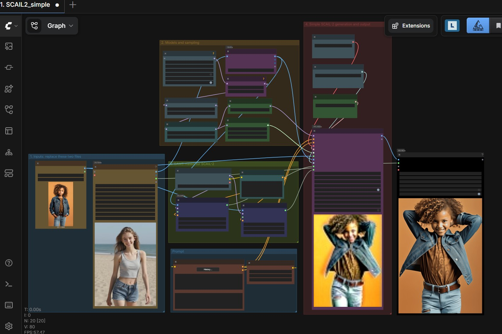

# WAN 2.x inference with ComfyUI

A streamlined and automated environment for running **ComfyUI** with **WAN 2.x video models**, optimized for use on RunPod.

## Example workflows

### WAN 2.2 i2v long video

## Scail-2 i2v long video motion transfer

## What to expect

These templates are intended for users who already want to run ComfyUI on RunPod and are comfortable following technical setup steps. No Linux expertise is required for normal use, but basic familiarity with RunPod pods, logs, tokens, and file management is helpful.

## When to use this template

Use this template for WAN 2.x video generation, image-to-video, animation, long-video, SVI, and SCAIL-2 workflows.

## Purpose of this pod

This pod is designed as an experimental ComfyUI environment for image creators who want maximum creative freedom. It focuses on integrating image models, editing models, LoRAs, and custom nodes that reduce unnecessary workflow restrictions and make it easier to test open, flexible, and uncensored creative pipelines.

The guiding idea is aligned with the open-model discussion described by Eric Hartford in [Uncensored Models](https://erichartford.com/uncensored-models): local and open AI systems should give advanced users more ownership, control, and composability. In this context, the pod is not a safety policy or content platform. It is a technical workspace for responsible users who want to explore creative image generation, image editing, prompt enhancement, captioning, and model combinations with as much artistic latitude as the available models and custom nodes allow.

## 🔧 Features

- Automatic model and LoRA provisioning via environment variables.
- Included workflows for **video generation** and **enhancement** using pre-installed custom nodes.
- Compatible with high-performance NVIDIA GPUs (CUDA 12.8).
- Compiled attention and GPU acceleration.
- Latent preview enabled for samplers.
- LoRA Manager.

## 🔧 Built-in **authentication**
  
- ComfyUI
- Code Server
- Hugging Face API
- CivitAI API

## 📦 Deployment on RunPod

- [👉 Templates](ComfyUI_WAN_deployment.md)

## 📘 Tutorial

- [Specific for these templates](ComfyUI_WAN_tutorial.md)

### Pod running on L40S

### Pod running on A40

