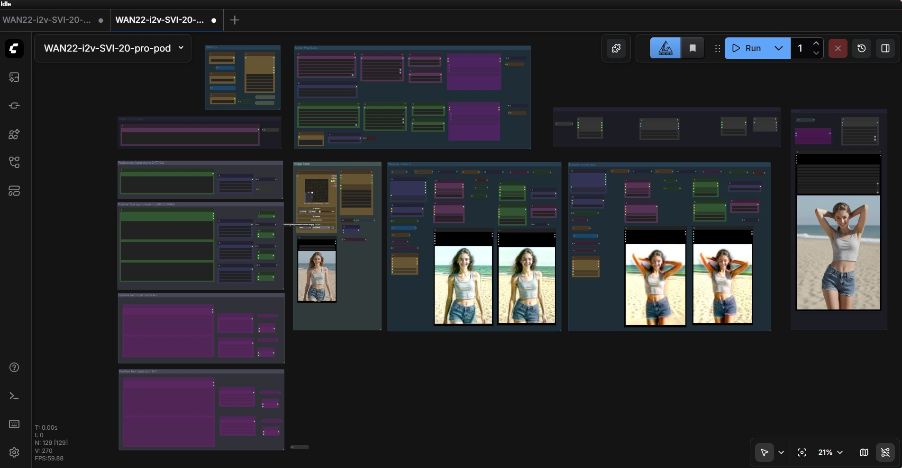
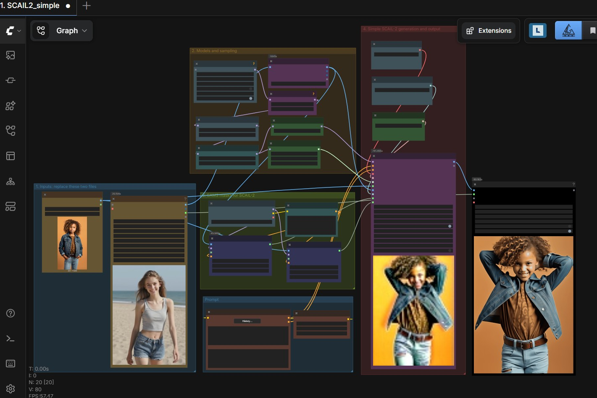
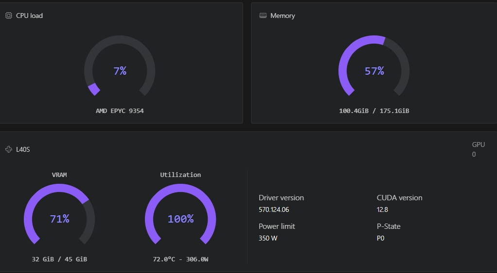
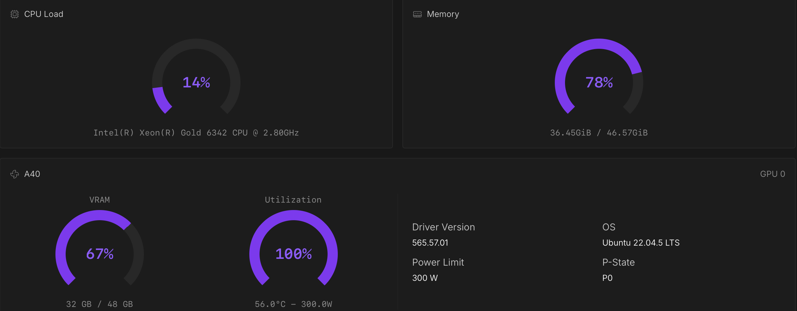

# WAN 2.x inference with ComfyUI

A streamlined and automated environment for running **ComfyUI** with **WAN 2.x video models**, optimized for use on RunPod.

## Example workflows

### WAN 2.2 i2v long video

## Scail-2 i2v long video motion transfer

## What to expect

These templates are intended for users who want to run ComfyUI on RunPod and are comfortable following technical setup steps. No Linux expertise is required for normal use, but basic familiarity with RunPod pods, logs, tokens and file management is helpful.

The pod is an experimental workspace for video creators who want to combine generation models, editing models, LoRAs and custom nodes in open and flexible creative pipelines. It supports video generation, identity-aware video generation, prompt enhancement and long video generation.

The approach is aligned with the open-model discussion in Eric Hartford's [Uncensored Models](https://erichartford.com/uncensored-models): local and open AI systems give advanced users more ownership, control and composability. The pod is a technical workspace for responsible use rather than a content platform or safety policy.

## 🔧 Features

- Automatic model and LoRA provisioning via environment variables.
- Included workflows for **video generation** and **enhancement** using pre-installed custom nodes.
- Compatible with high-performance NVIDIA GPUs (CUDA 12.8).
- Compiled attention and GPU acceleration.
- Latent preview enabled for samplers.
- LoRA Manager.

## 🔧 Built-in **authentication**
  
- ComfyUI
- Code Server
- Hugging Face API
- CivitAI API

## 📦 Deployment on RunPod

- [👉 Templates](ComfyUI_WAN_deployment.md)

## 📘 Tutorial

- [Specific for these templates](ComfyUI_tutorial.md)

### Pod running on L40S

### Pod running on A40

## More information

- [Environment configuration](RunPod_configuration.md)
- [Hardware guidance](ComfyUI_WAN_hardware.md)
- [Image setup](ComfyUI_WAN_image_setup.md)
- [Custom nodes](ComfyUI_WAN_custom_nodes.md)
- [Resources](ComfyUI_WAN_resources.md)
- [Updates](ComfyUI_WAN_update.md)

