# 📘 Tutorial run-comfyui-wan2

- This tutorial reflects my own experience on RunPod.
- Always consult the excellent official [RunPod documentation](https://docs.runpod.io/pods/overview).

## Common tasks

- [Start a pod](#starting-a-pod)
- [Connect to your pod](#connecting-to-your-pod)
- [Open the web terminal](#web-terminal)
- [Log in to Code-Server](#code-server-login)
- [Configure secrets](#secrets)
- [Download models and LoRAs](#downloading-models-and-loras)
- [Delete models and LoRAs](#deleting-models-and-loras)
- [Manage the pod](#pod-management)
- [Upload and download files](#uploading-downloading-files)
- [Use RunPod API](#runpod-api)

## 🚀 Starting a Pod

### 🧩 Choose a Template

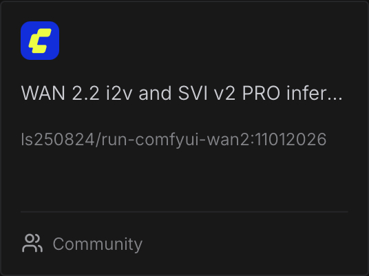{ width="300" }

Example:
👉 [WAN 2.2 T2V (lightx2v)](https://console.runpod.io/deploy?template=qvozvvb1xd&ref=se4tkc5o)

Steps:

1. Choose a [GPU](ComfyUI_WAN_hardware.md)
2. Edit template settings if needed.  
3. Choose **Volume disk** (/workspace)
4. Enable Volume encryption if desired.
5. Click **Deploy On-Demand**.

### ⚠️ CUDA errors when deploying pod

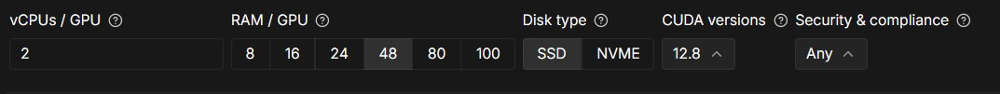

- Deploy in another region.
- Change filter to CUDA 12.8 on the RunPod console

### 📜 Viewing System Logs

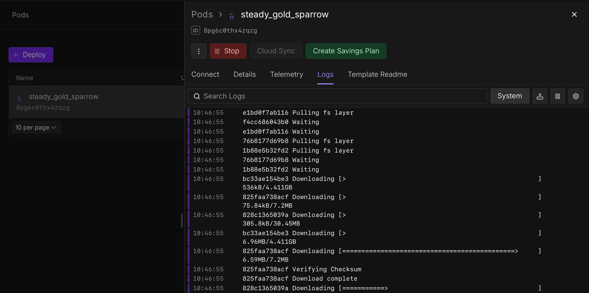

- Go to **Logs**.  
- Loading takes **9–15 minutes** depending on region.  
- If the image doesn’t begin downloading after **1 minute**, delete and redeploy in another region.

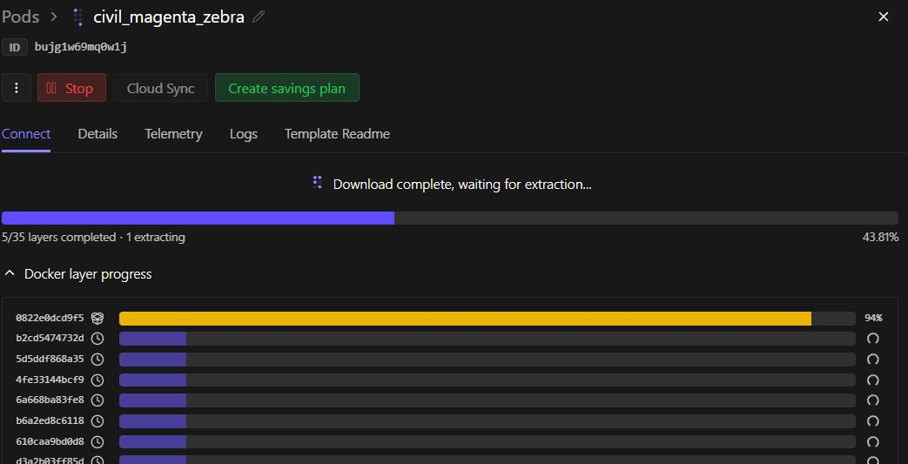

Ends with (example):

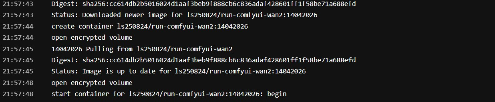

### 🐳 Viewing Container Logs

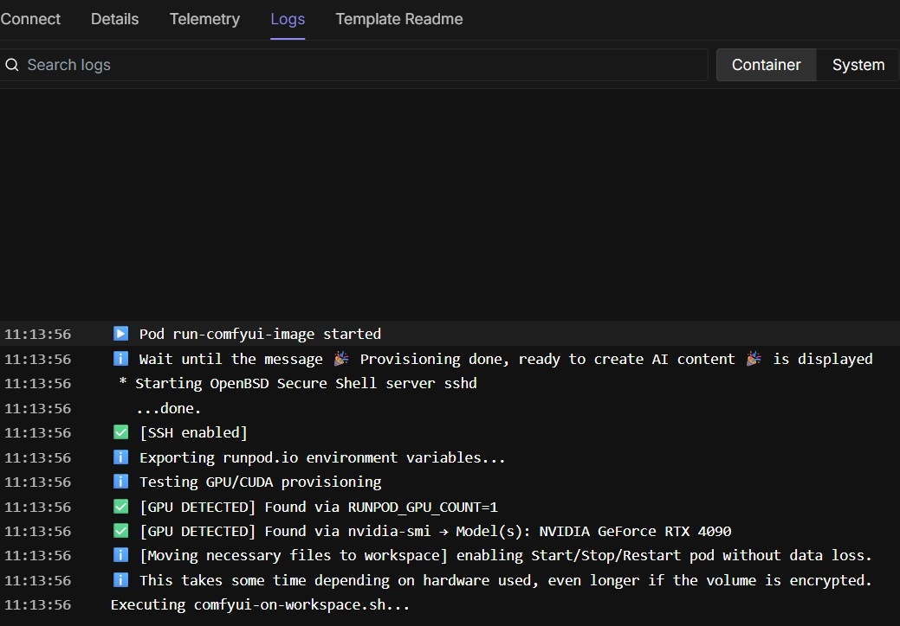

When you see:

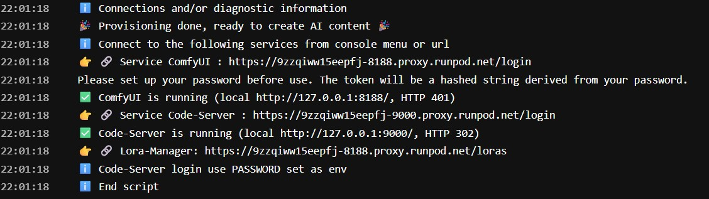

→ Your pod is ready.

### ⚠️ Hugging Face download takes longer than usual

If the Hugging Face download takes longer than usual, restart the pod and try again. Download time still depends on the file size and the speed of the network connection.

## 🔌 Connecting to Your Pod

[Docs](https://docs.runpod.io/pods/connect-to-a-pod)

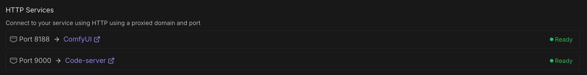

### ⚠️ Not ready – Make sure your service is running! or browser unauthorized error.

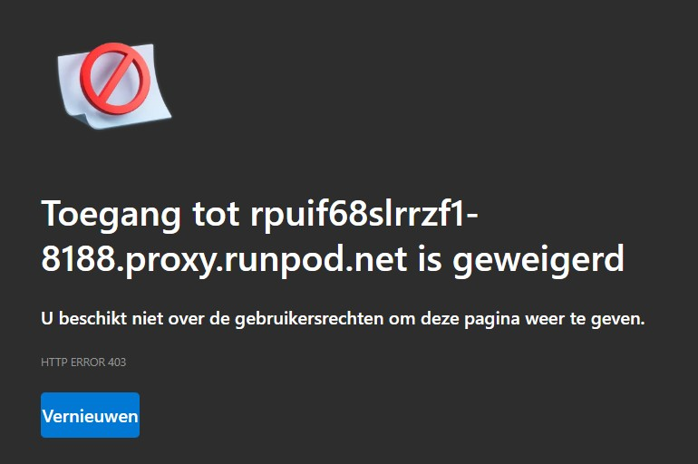{ width="400" }

Try to connect with the pod-id and the port number to the proxy.
You can find the URLs at the end of the log file in the RunPod console.

- ComfyUI: `https://<pod-id>-8188.proxy.runpod.net/login`
- Code-Server: `https://<pod-id>-9000.proxy.runpod.net/login`

### 🎨 ComfyUI

1. Select tab **Connect** → **ComfyUI**
2. Set username/password
3. Load a workflow from the left menu 
4. Press **Run**  
5. Monitor GPU/RAM via **Telemetry**

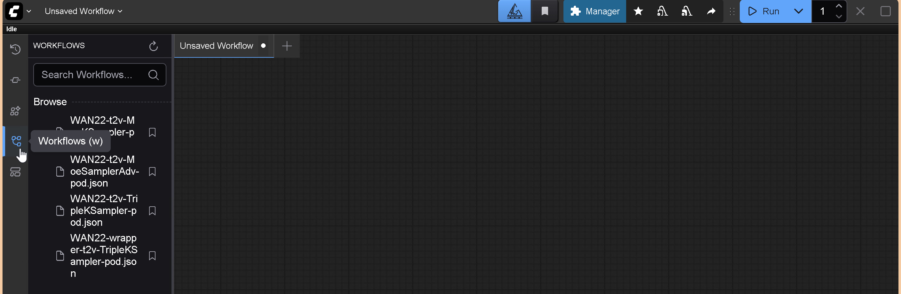{ width="500" }

### ⚠️ ComfyUI's screen remains blank

- Wait one minute and try again.
- Restart your browser and/or clear cache.
- Try with another browser (brave, chrome, edge).

## 💻 Web Terminal

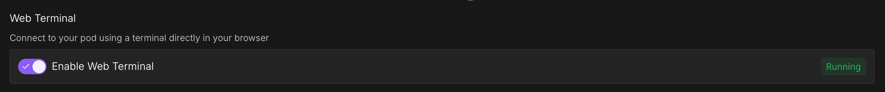

- Select tab **Connect**
- Enable **web terminal**  
- Provides terminal access directly in your browser.

## 🧑‍💻 Code-Server Login

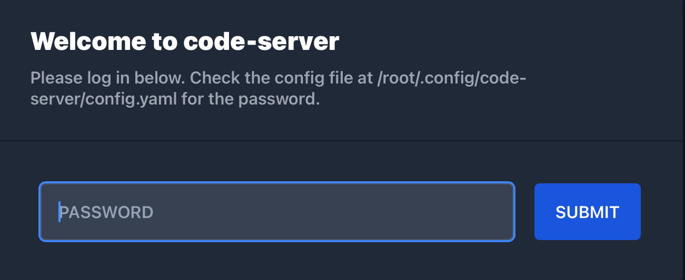{ width="500" }

### No "PASSWORD" set

- Copy the password displayed at the end of the container log file of the RunPod console or open the web terminal and enter.

```bash
cat /root/.config/code-server/config.yaml
```

Copy the password → log in via the Code-Server service on tab **Connect**.

### Information in pod available

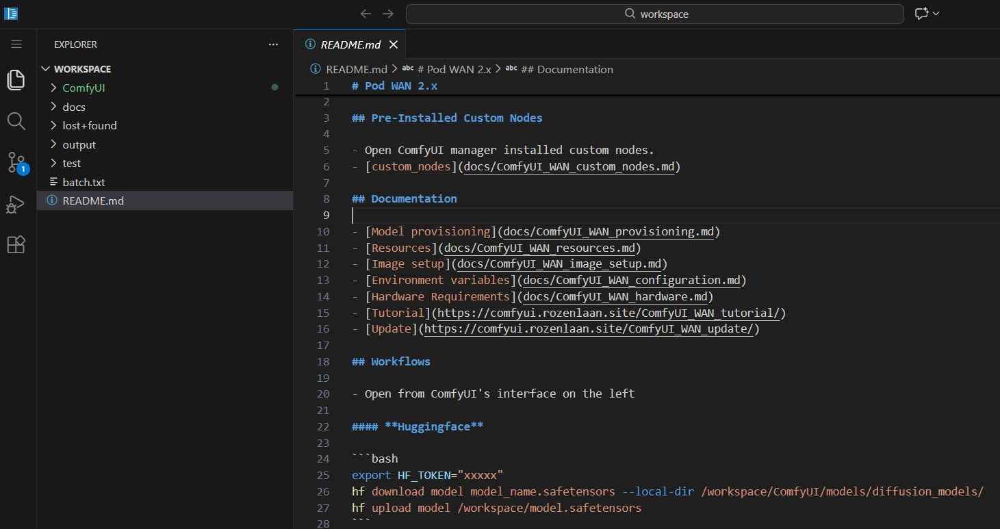

### ⚠️ Code-Server's screen remains blank

- Wait one minute and try again.
- Restart your browser and/or clear cache.
- Try another browser (brave, chrome, edge).

### "PASSWORD" set as env in RunPod template

Log in via the Code-Server service on tab **Connect**.

## 🔐 Secrets

[Docs](https://docs.runpod.io/pods/templates/secrets#manage-secrets)

Useful secrets:

- `PASSWORD`
- `CIVITAI_TOKEN`
- `HF_TOKEN`

## 📥 Downloading Models and LoRAs

From web terminal, Code-Server or ComfyUI-Lora-Manager.

### 🧩 ComfyUI-Lora-Manager

- [Github](https://github.com/willmiao/ComfyUI-Lora-Manager)

#### Launch web interface

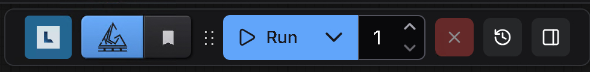{ width="300" }

- Topbar ComfyUI.
- URL displayed at end of container log file.

```txt
https://<pod-id>-8188.proxy.runpod.net/loras
```
	
#### Civitai token (needed for download)

- Go to preferences and add your token if not set before starting the pod (CIVITAI_TOKEN).

#### Refresh/Fetch/Download models

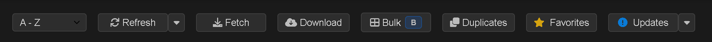

- Press **Refresh** and **Fetch** to download images for lora's available in the pod.
- Press **Download** and add the civitai's URL to download the highnoise model (not download link).
- Press **Download** and add the civitai's URL to download the lownoise model (not download link).

#### Integration basic

- Add high- and lownoise node **Lora-Loader (LoraManager)** to your ComfyUI workflow.
- Press the **Paper Airplanes** of the low- and highnoise model in the Lora-Manager web interface.
- Your loras are available in your workflow.

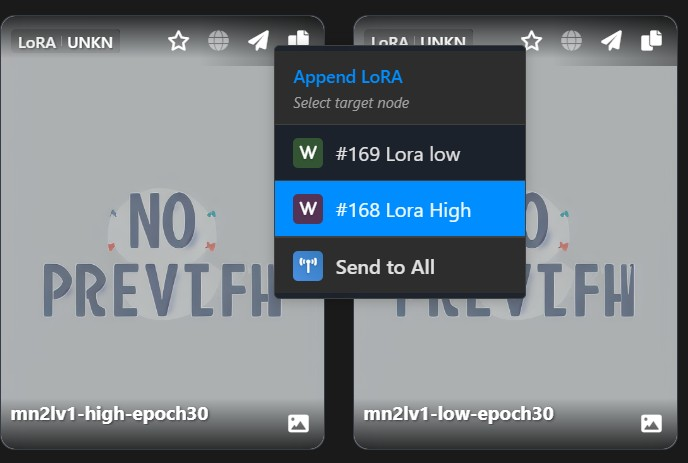{ width="300" }

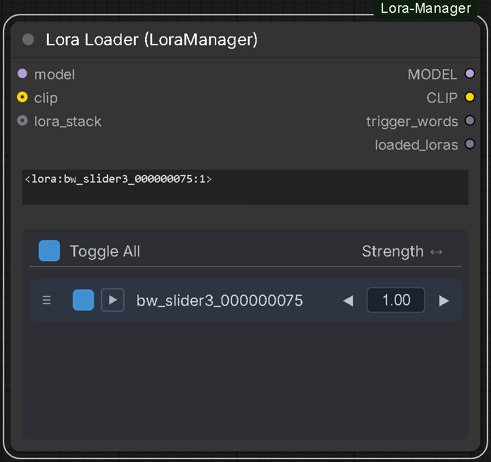{ width="300" }

### 🧩 CivitAI CLI

If no "CIVITAI_TOKEN" was set, create or use a free token from the civitai website.

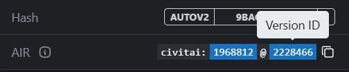{ width="300" }

```bash
export CIVITAI_TOKEN=“xxxxx”
civitai_com  VERSION_ID /workspace/ComfyUI/models/<loras, etc>
civitai_red  VERSION_ID /workspace/ComfyUI/models/<loras, etc>
```

```bash
civitai_com 2228466 /workspace/ComfyUI/models/loras/
civitai_red 2893442 /workspace/ComfyUI/models/loras/
```

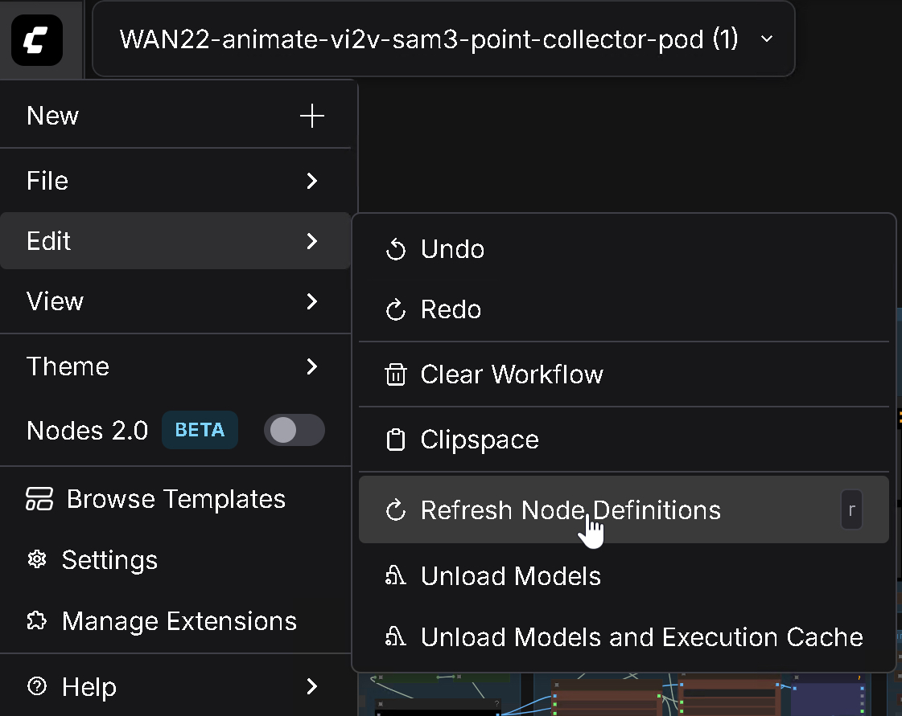{ width="300" }

Refresh ComfyUI pressing key **r**.

### ☁️ HuggingFace cli

"HF_TOKEN" is mandatory but needed for gated sites or upload.

Login:

```bash
hf auth login --token xxxxx
```

or set token:

```bash
export HF_TOKEN="xxxxx"
```

Download example from [Huggingface](https://huggingface.co/ricecake/wan21NSFWClipVisionH_v10/tree/main).

```bash
hf download ricecake/wan21NSFWClipVisionH_v10 wan21NSFWClipVisionH_v10.safetensors --local-dir /workspace/ComfyUI/models/clip_vision
```

Refresh ComfyUI pressing key **r**.

### Manual provisioning

- Information is available in the pod's documentation.
- Open web terminal or code-server.

## 🧩 Deleting Models and LoRAs

### Web Console or code-server

- Type "ncdu" in the console
- Follow the instructions.

### Lora Manager

- Select lora 
- Select delete.

## 🧩 ComfyUI-manager

- Topbar or menu

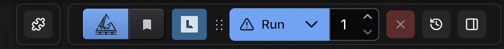{ width="300" }

## 🧩 Pod management

[RunPod pod management](RunPod_pod_management.md)

## 🔄 Uploading & Downloading Files

[RunPod file management](RunPod_file_management.md)

## 🔧 Advanced Features

[RunPod advanced features](RunPod_advanced_features.md)

## 🔑 RunPod API

[RunPod API](RunPod_api.md)
