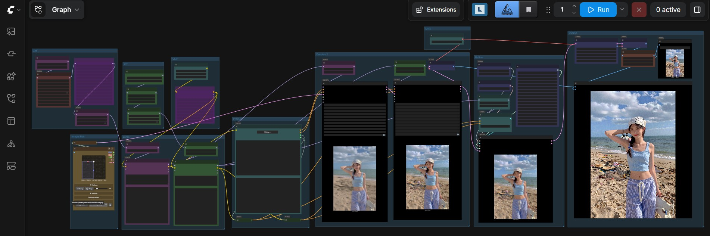
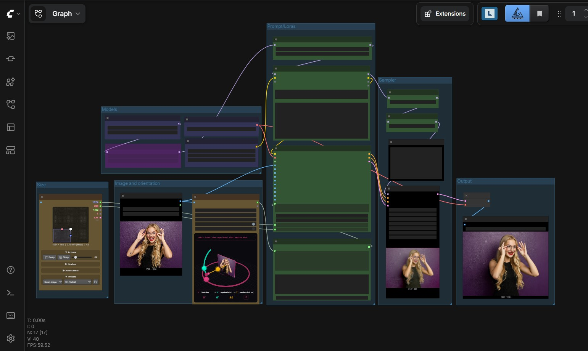
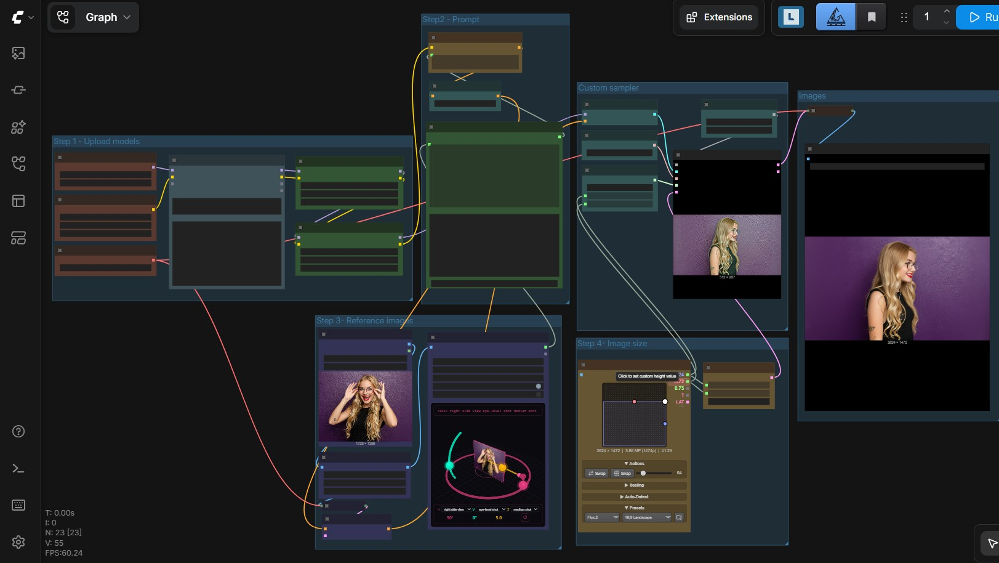
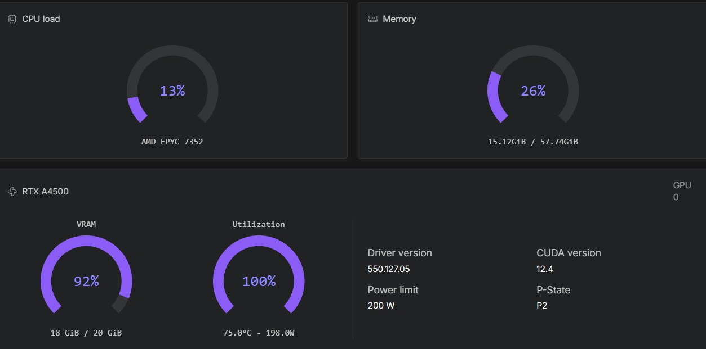
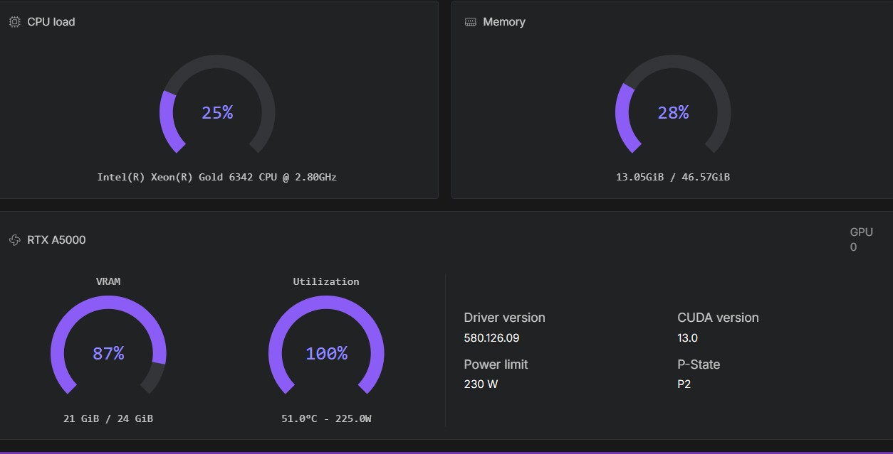
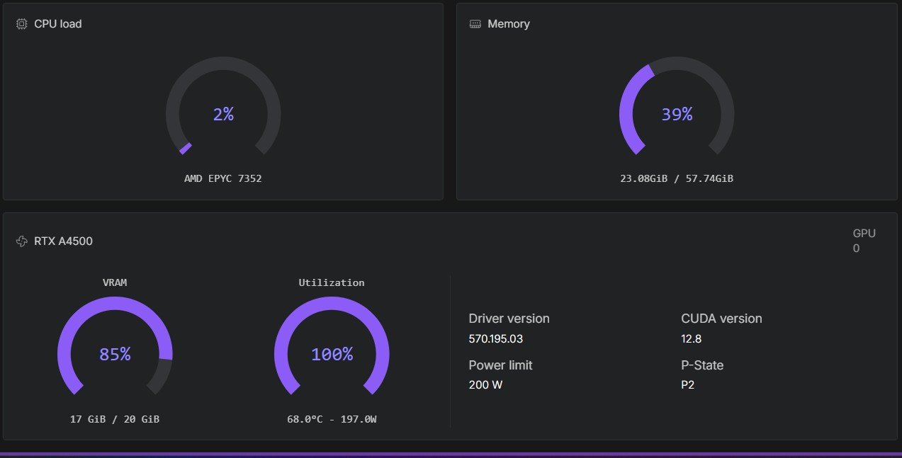
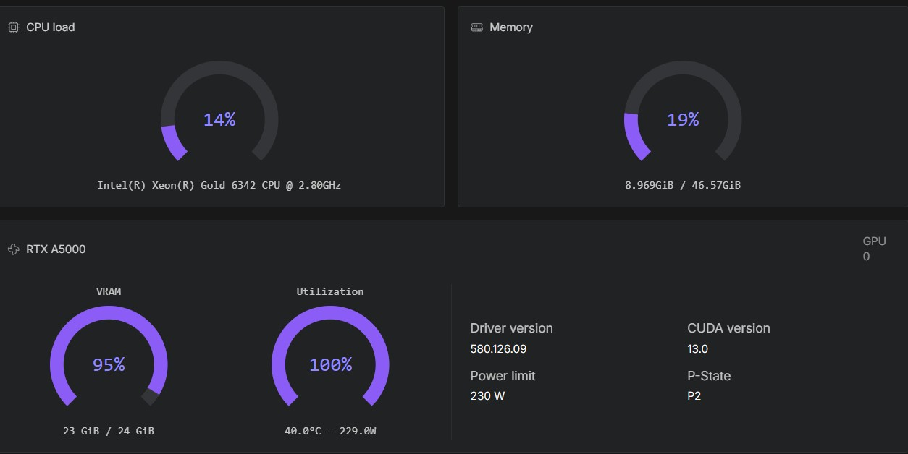
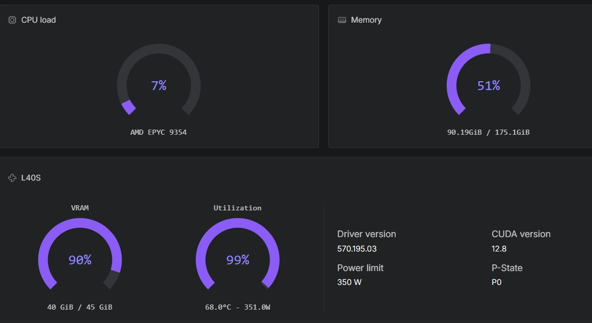
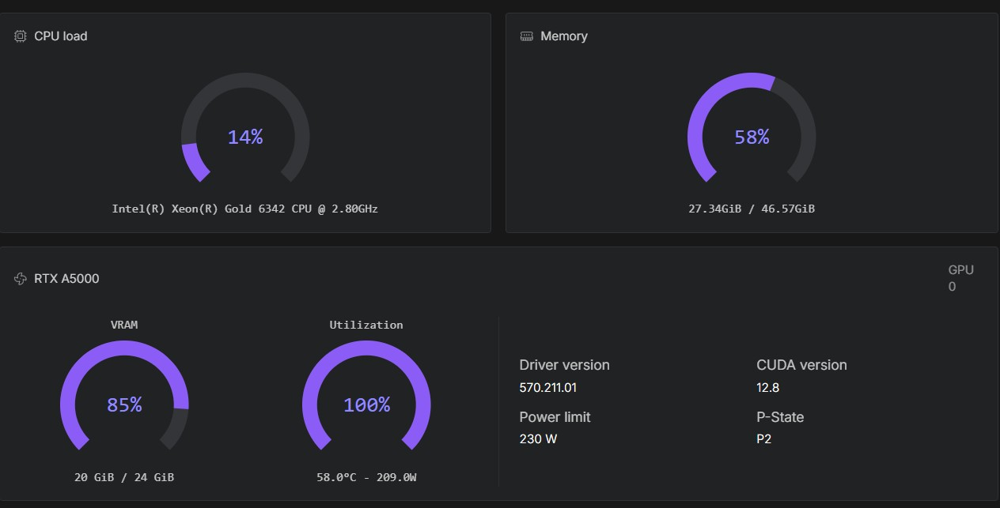

# Image inference with ComfyUI 

A streamlined and automated environment for running **ComfyUI** with **image/edit models**, optimized for use on RunPod

## Example ZIB-ZIT

## Example QWEN-EDIT MULTIPLE ANGLES

## Example FLUX.2 Dev MULTIPLE ANGLES

## 🔧 Features

- Automatic model and LoRA provisioning via environment variables.
- Included workflows for **image generation** and **enhancement** using pre-installed custom nodes.
- Compatible with high-performance NVIDIA GPUs (CUDA 12.8).
- Compiled attentions and GPU accelerations.
- Automatic selecting bf16 or fp8 models/workflows.
- Lora manager

## 🔧 Built-in **authentication**
  
- ComfyUI
- Code Server
- Hugging Face API
- CivitAI API

## 📦 Deployment on runpod

- [👉 Templates](ComfyUI_image_deployment.md)

### Example is running Z-image on a RTX A4500

### Example is running Z-image on a RTX A5000

### Example is running Flux Klein 9B on a RTX A4500

### Example is running QWEN-EDIT fp8 on a RTX A5000

### Example is running FLUX.2 Dev bf16 on a L40S

### Example is running FLUX.2 Dev fp8 on a RTX A5000 (slow)

