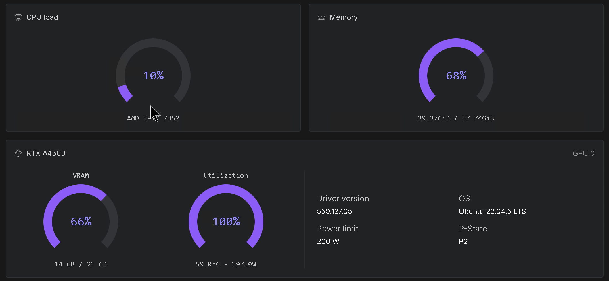

# Image inference with ComfyUI 

A streamlined and automated environment for running **ComfyUI** with **image/edit models**, optimized for use on RunPod

## 🔧 Features

- Automatic model and LoRA provisioning via environment variables.
- Included workflows for **image generation** and **enhancement** using pre-installed custom nodes.
- Compatible with high-performance NVIDIA GPUs (CUDA 12.8).
- Compiled attentions and GPU accelerations.
- Automatic selecting bf16 or fp8 models/workflows.
- Lora manager

## 🔧 Built-in **authentication**
  
- ComfyUI
- Code Server
- Hugging Face API
- CivitAI API

## 📦 Deployment on runpod

- [👉 Templates](ComfyUI_image_deployment.md)

### Example is running Z-image Turbo on a RTX A4500 on Runpod

### Example is running Flux Klein 9B on a RTX A4500 on Runpod

