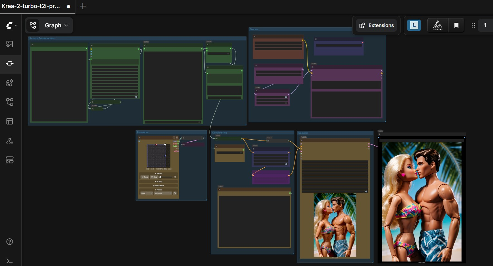
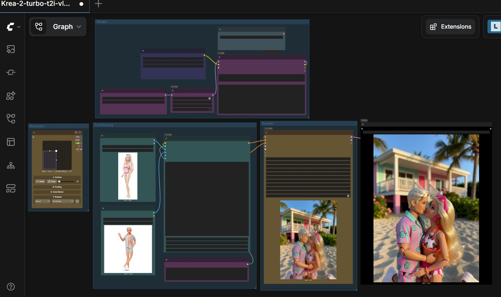
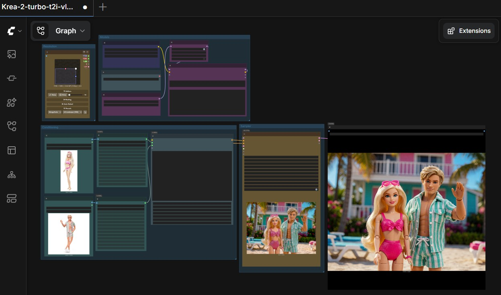
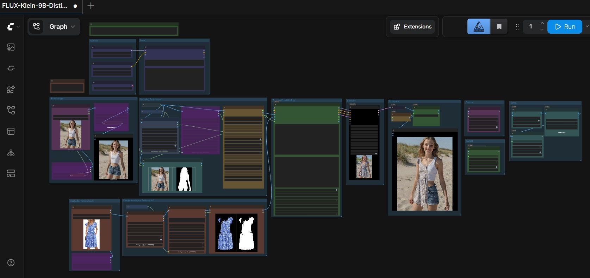
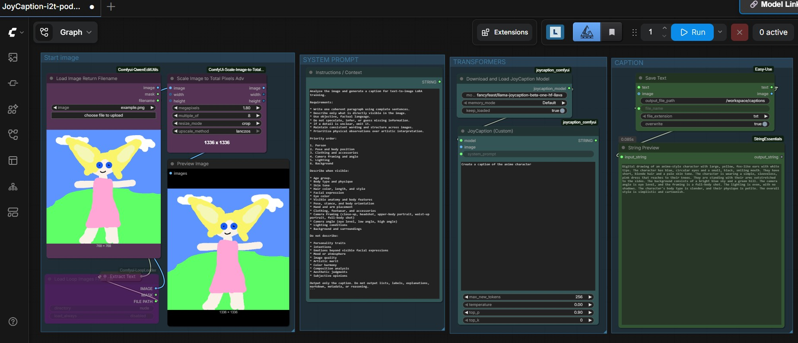
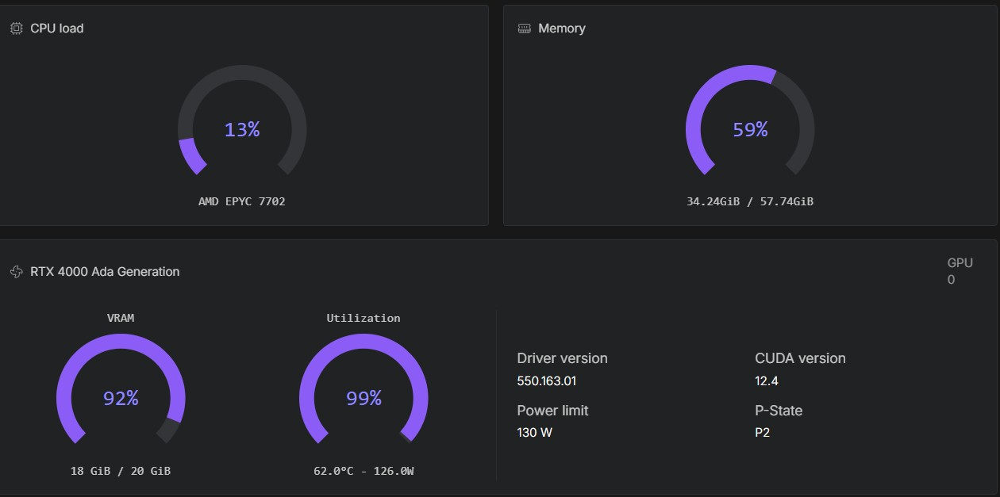
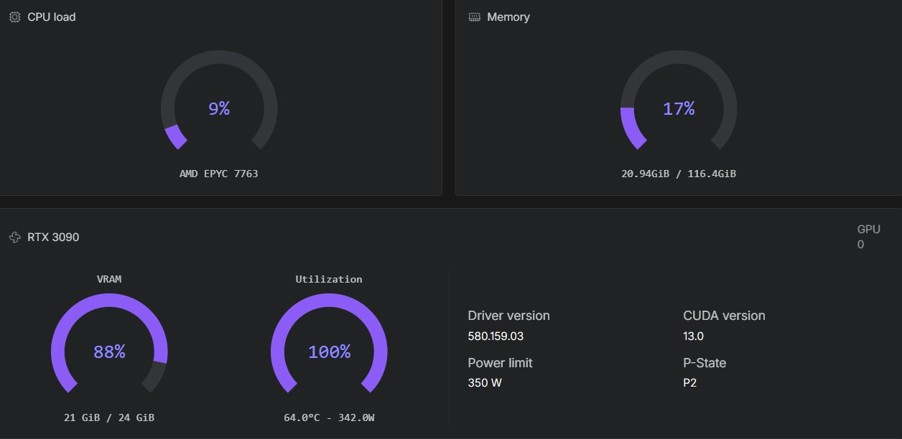
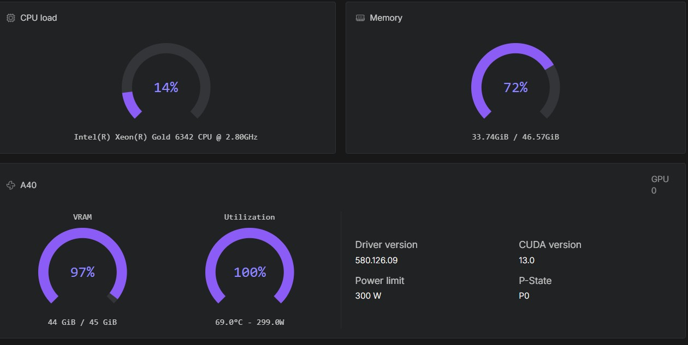
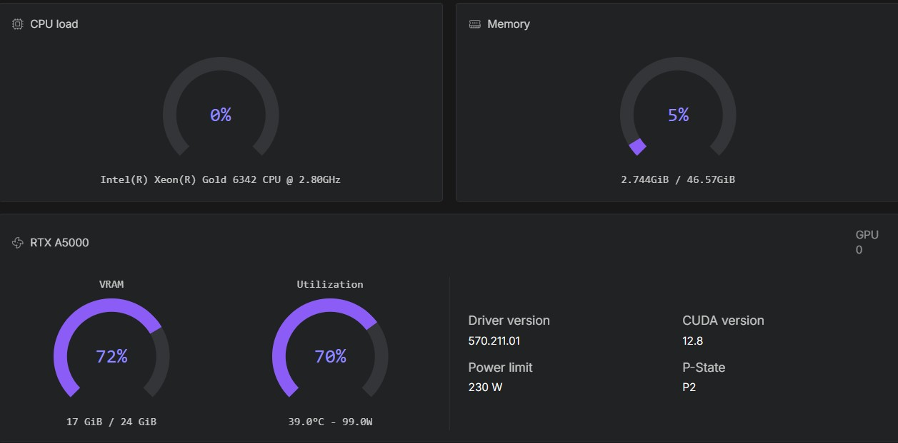
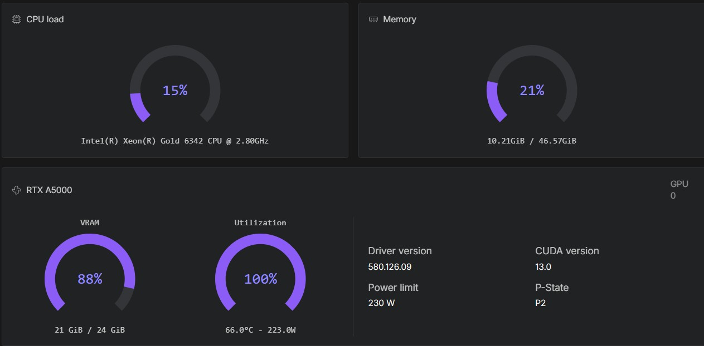

# Image inference with ComfyUI

A streamlined and automated environment for running **ComfyUI** with **image/edit models**, optimized for use on RunPod.

## What to expect

These templates are intended for users who already want to run ComfyUI on RunPod and are comfortable following technical setup steps. No Linux expertise is required for normal use, but basic familiarity with RunPod pods, logs, tokens, and file management is helpful.

## When to use this template

Use this template for image generation and image editing workflows with Z-Image, ERNIE-Image, FLUX.2, FLUX.2 Klein, Qwen-Image, JoyCaption, Krea-2 and Qwen-Image-Edit models.

## Purpose of this pod

This pod is designed as an experimental ComfyUI environment for image creators who want maximum creative freedom. It focuses on integrating image models, editing models, LoRAs, and custom nodes that reduce unnecessary workflow restrictions and make it easier to test open, flexible, and uncensored creative pipelines.

The guiding idea is aligned with the open-model discussion described by Eric Hartford in [Uncensored Models](https://erichartford.com/uncensored-models): local and open AI systems should give advanced users more ownership, control, and composability. In this context, the pod is not a safety policy or content platform. It is a technical workspace for responsible users who want to explore creative image generation, image editing, prompt enhancement, captioning, and model combinations with as much artistic latitude as the available models and custom nodes allow.

## 🔧 Features

- Automatic model and LoRA provisioning via environment variables.
- Included workflows for **image generation** and **enhancement** using pre-installed custom nodes.
- Compatible with high-performance NVIDIA GPUs (CUDA 12.8).
- Compiled attention and GPU acceleration.
- Automatic selection of bf16 or fp8 models/workflows.
- LoRA Manager.

## 🔧 Built-in **authentication**
  
- ComfyUI
- Code Server
- Hugging Face API
- CivitAI API

## 📦 Deployment on RunPod

- [👉 Templates](ComfyUI_image_deployment.md)

## 📘 Tutorial

- [Specific for these templates](ComfyUI_image_tutorial.md)

##  Example t2i workflow Krea-2 uncensored with prompt enhancer

##  Example t2i workflow Krea-2 uncensored with image conditioning without vae encoding.

##  Example t2i workflow Krea-2 artist friendly conditioning

##  Example workflow FLUX-Klein control/target image generation uncensored

##  Example workflow Qwen-Image-Edit multiple angles

##  Example workflow FLUX.2 Dev multiple angles

##  Example workflow ZIB-ZIT uncensored

##  Example workflow JoyCaption

###  Example running Z-Image on an RTX A4500

###  Example running Z-Image on an RTX A5000

###  Example running Z-Image on an RTX 4000 Ada

###  Example running Z-Image on an RTX 3090

###  Example running FLUX.2 Klein 9B on an RTX A4500

###  Example running Qwen-Image-Edit fp8 on an RTX A5000

###  Example running Qwen-Image-Edit bf16 on an A40

###  Example running FLUX.2 Dev bf16 on an L40S

###  Example running FLUX.2 Dev fp8 on an RTX A5000 (slow)

###  Example running Krea-2 turbo fp8 on an RTX A5000

###  Example running Krea-2 turbo bf16 on an RTX A5000

