# 📘 ComfyUI tutorials

The general instructions apply to every template. Where the templates differ, the instructions are split by template.

- This tutorial reflects my own experience on RunPod.
- Always consult the excellent official [RunPod documentation](https://docs.runpod.io/pods/overview).

## Common tasks

- [Start a pod](Runpod_pod_deployment.md)
- [Connect to your pod](#connecting-to-your-pod)
- [Open the web terminal](#web-terminal)
- [Log in to Code-Server](#code-server-login)
- [Configure secrets](#secrets)
- [Download models and LoRAs](#downloading-models-and-loras)
- [Link models](#model-linker)
- [Delete models and LoRAs](#deleting-models-and-loras)
- [Manage the pod](#pod-management)
- [Upload and download files](#uploading-downloading-files)
- [Use the RunPod API](#runpod-api)

## 🚀 Starting a Pod

[Start a pod on RunPod](Runpod_pod_deployment.md)

## 🔌 Connecting to Your Pod

[RunPod connection documentation](https://docs.runpod.io/pods/connect-to-a-pod)

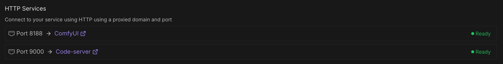

### ⚠️ Service not ready or browser unauthorized

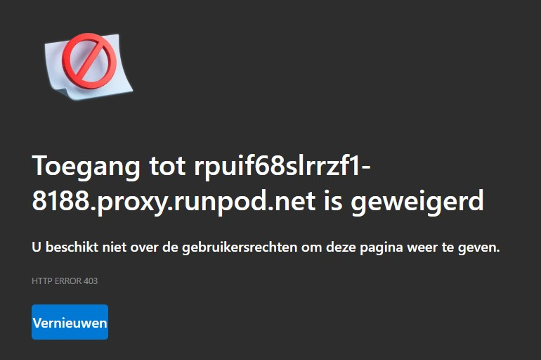{ width="400" }

Try to connect through the proxy with the pod ID and port number. You can find the URLs at the end of the log file in the RunPod console.

- ComfyUI: `https://<pod-id>-8188.proxy.runpod.net/login`
- Code-Server: `https://<pod-id>-9000.proxy.runpod.net/login`

### 🎨 ComfyUI

1. Select the **Connect** tab → **ComfyUI**.
2. Set the username and password.
3. Load a workflow from the left menu.
4. Press **Run**.
5. Monitor GPU and RAM usage via **Telemetry**.

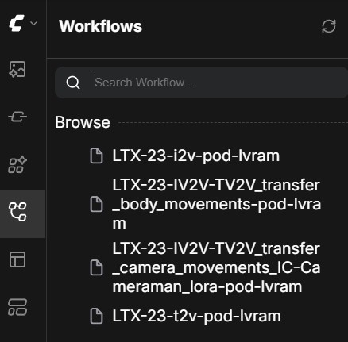{ width="500" }

{ width="500" }

### ⚠️ ComfyUI screen remains blank

- Wait one minute and try again.
- Restart your browser and/or clear its cache.
- Try another browser, such as Brave, Chrome, or Edge.

## 💻 Web Terminal

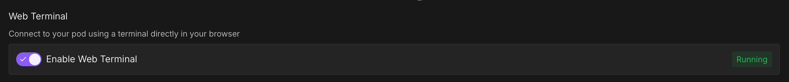

- Select the **Connect** tab.
- Enable **Web Terminal**.
- The terminal is now available directly in your browser.

## 🧑‍💻 Code-Server Login

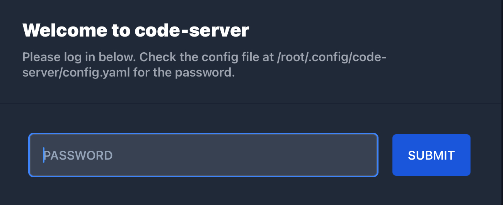{ width="500" }

### No `PASSWORD` set

Copy the password displayed at the end of the container log in the RunPod console, or open the web terminal and enter:

```bash
cat /root/.config/code-server/config.yaml
```

Copy the password and log in through the Code-Server service on the **Connect** tab.

### `PASSWORD` set in the RunPod template

Log in through the Code-Server service on the **Connect** tab.

### Information available in the pod

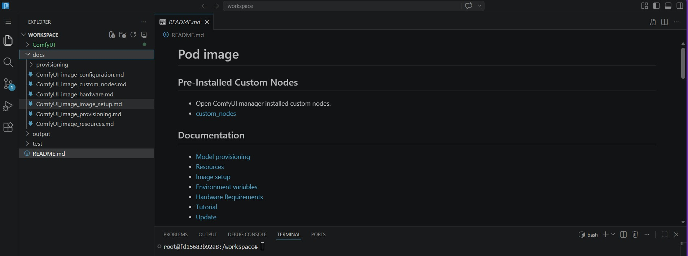

### ⚠️ Code-Server screen remains blank

- Wait one minute and try again.
- Restart your browser and/or clear its cache.
- Try another browser, such as Brave, Chrome, or Edge.

## 🔐 Secrets

[RunPod secrets documentation](https://docs.runpod.io/pods/templates/secrets#manage-secrets)

Useful secrets:

- `PASSWORD` for the Code-Server login
- `CIVITAI_TOKEN` for Civitai
- `HF_TOKEN` for Hugging Face

## 📥 Downloading Models and LoRAs

Use the web terminal, Code-Server, or ComfyUI-Lora-Manager.

### 🧩 ComfyUI-Lora-Manager

- [ComfyUI-Lora-Manager on GitHub](https://github.com/willmiao/ComfyUI-Lora-Manager)

#### Launch the web interface

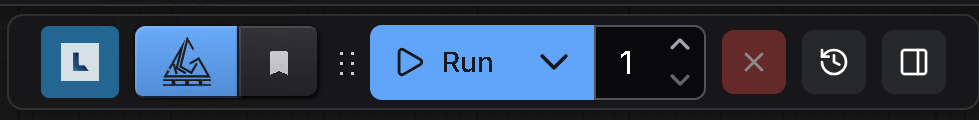{ width="300" }

- Open it from the ComfyUI top bar.
- Alternatively, use the URL displayed at the end of the container log:

```txt
https://<pod-id>-8188.proxy.runpod.net/loras
```

#### Civitai token

Go to Preferences and add your `CIVITAI_TOKEN` if it was not set before starting the pod.

#### Refresh, fetch, and download models

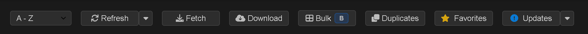

- Press **Refresh** and **Fetch** to download images for LoRAs already available in the pod.
- Press **Download** and enter the Civitai page URL, not the download URL.
- For `run-comfyui-wan2`, download both the high-noise and low-noise models separately.

#### Basic integration

For `run-comfyui-image`, `run-comfyui-ltx`, and `run-comfyui-minimax`:

- Add a **Lora-Loader (LoraManager)** node to your ComfyUI workflow.
- Press the **Paper Airplane** in the LoRA Manager web interface.
- The LoRA becomes available in your workflow.

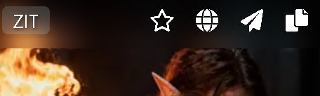

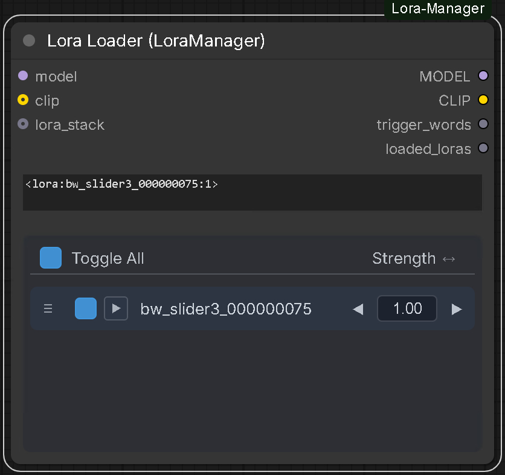{ width="300" }

#### High/Low noise model WAN 2.2

- Add high-noise and low-noise **Lora-Loader (LoraManager)** nodes to your workflow.
- Press the **Paper Airplane** for both models in the LoRA Manager web interface.
- Both LoRAs become available in your workflow.

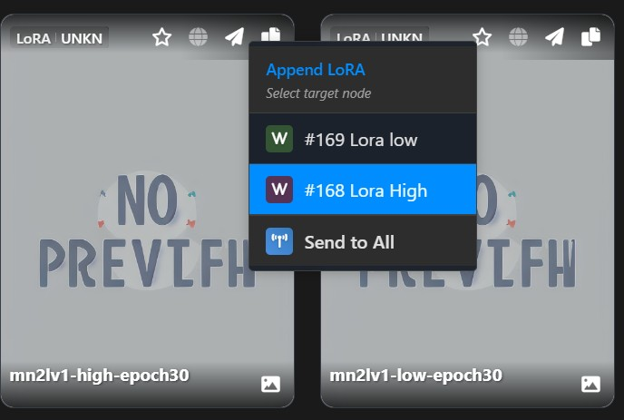{ width="300" }

### 🧩 Model linker

- It tries to link models found in workflows to the pod provisioning.
- It can download models, but be aware of the pod's limited volume capacity.
- [Author's example](https://github.com/kianxyzw/comfyui-model-linker)

#### Example: linking models in a ComfyUI template

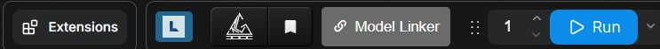{ width="500" }

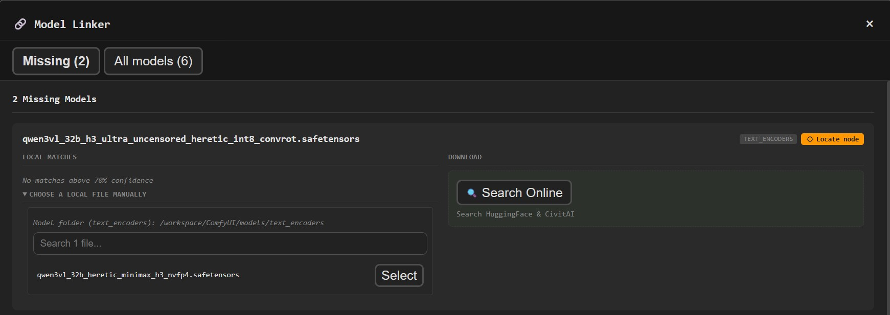{ width="500" }

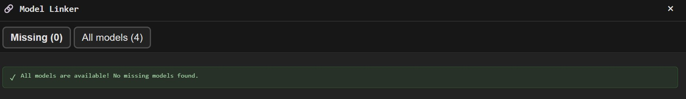{ width="500" }

### 🧩 CivitAI CLI

If no `CIVITAI_TOKEN` was set, create or use a free token from the Civitai website.

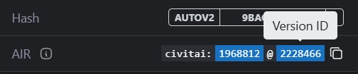{ width="400" }

```bash
export CIVITAI_TOKEN="xxxxx"
civitai_com VERSION_ID /workspace/ComfyUI/models/<loras, etc>
civitai_red VERSION_ID /workspace/ComfyUI/models/<loras, etc>
```

Examples:

```bash
civitai_com 2228466 /workspace/ComfyUI/models/loras/
civitai_red 2893442 /workspace/ComfyUI/models/loras/
```

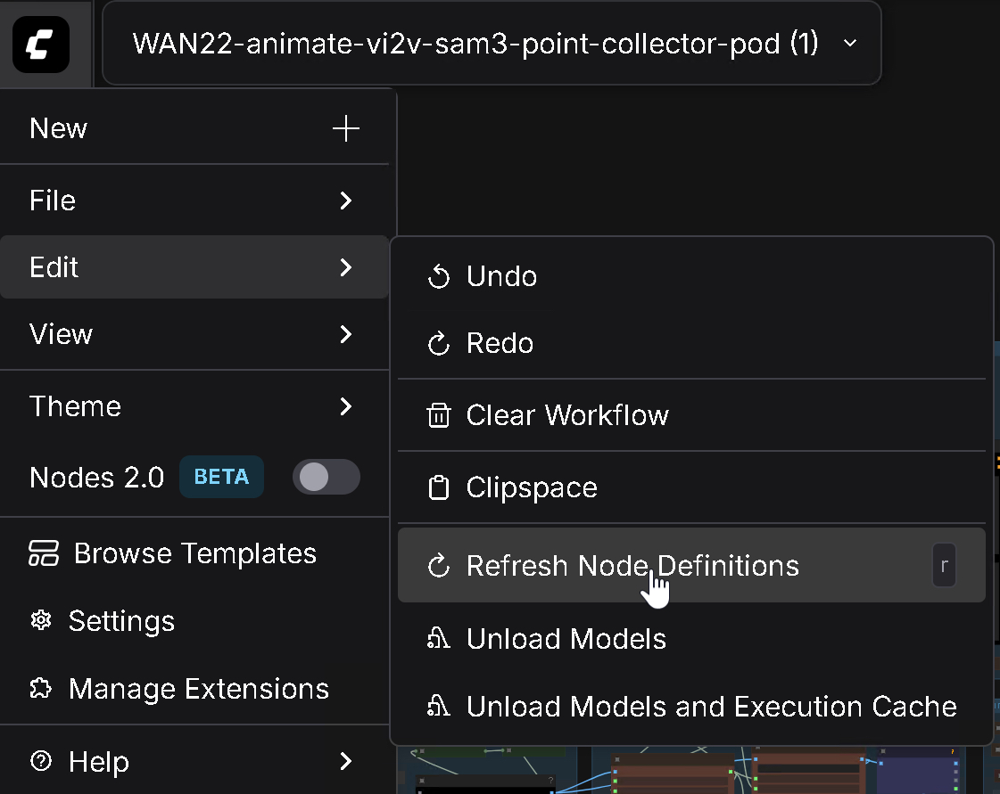{ width="400" }

Refresh ComfyUI by pressing **R**.

### ☁️ Hugging Face CLI

`HF_TOKEN` is required for gated repositories and uploads.

Log in:

```bash
hf auth login --token xxxxx
```

Or set the token:

```bash
export HF_TOKEN="xxxxx"
```

Download the example from [Hugging Face](https://huggingface.co/ricecake/wan21NSFWClipVisionH_v10/tree/main):

```bash
hf download ricecake/wan21NSFWClipVisionH_v10 wan21NSFWClipVisionH_v10.safetensors --local-dir /workspace/ComfyUI/models/clip_vision
```
Refresh ComfyUI by pressing **R**.

### Manual provisioning

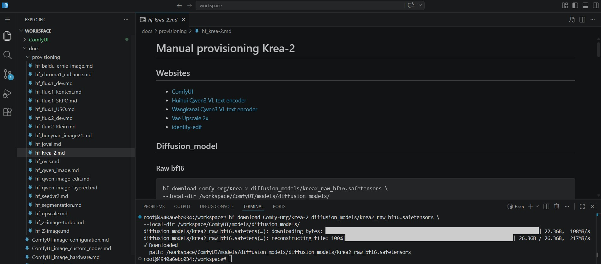

- Information is available in the pod's documentation.
- Open the web terminal or Code-Server.

## 🧩 Deleting Models and LoRAs

### Web terminal or Code-Server

- Enter `ncdu` in the terminal.
- Follow the on-screen instructions.

### LoRA Manager

- Select the LoRA.
- Select **Delete**.

## 🧩 ComfyUI Manager

Open it from the top bar or menu.

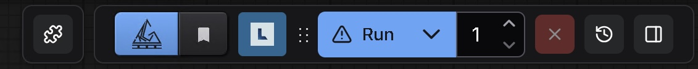{ width="300" }

## 🧩 Pod management

[RunPod pod management](RunPod_pod_management.md)

## 🔄 Uploading and Downloading Files

[RunPod file management](RunPod_file_management.md)

## 🔧 Advanced Features

[RunPod advanced features](RunPod_advanced_features.md)

## 🔑 RunPod API

[RunPod API](RunPod_api.md)
