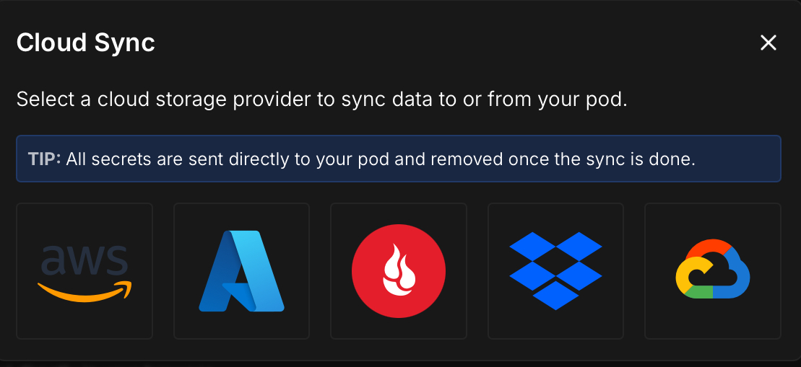

# 🔄 Uploading & Downloading Files

## ☁️ Cloud Sync

- [Docs](https://docs.runpod.io/pods/storage/cloud-sync)

### Free dropbox

{ width="400" }

- Reliable and fast upload and download for large files.
- Go to [Dropbox developers](https://www.dropbox.com/developers)
- **Create an app** to connect with RunPod.io.

## 📦 runpodctl

- [Docs](https://docs.runpod.io/runpodctl/overview)

### Speed

- **Fine** for **downloading** files from your pod.
- **Problematic** for **uploading large files** to your pod with slow connections (timeouts).

- You need to install a client on your local computer.
- You do **not** need an api key to upload/download to/from your pod.

### Install windows

```powershell
Invoke-WebRequest "https://github.com/runpod/runpodctl/releases/latest/download/runpodctl-windows-amd64.exe" -OutFile "runpodctl.exe"
```

### install linux

```bash
wget --quiet --show-progress https://github.com/runpod/runpodctl/releases/latest/download/runpodctl-linux-amd64 -O runpodctl && chmod +x runpodctl && sudo cp runpodctl /usr/bin/runpodctl
```
