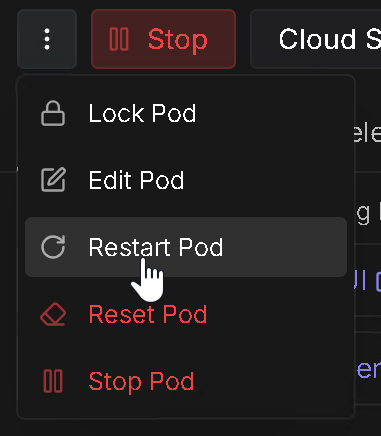

# 🧩 Pod management

## 🧩 Restart pod

- To restart ComfyUI, restart the pod from the RunPod console (no information loss).

{ width="300" }

## 🧩 Stop and restart a pod

- No information loss as ComfyUI is copied to the /workspace volume.
- Use this option to pause your pod.

### ⚠️ Be aware it is possible that no GPU is available when you restart the pod.

- Before stopping the pod copy your creations to cloud/local.
- You can still access the pod from with ssh or web console (0.5 vCPU and very little memory).
