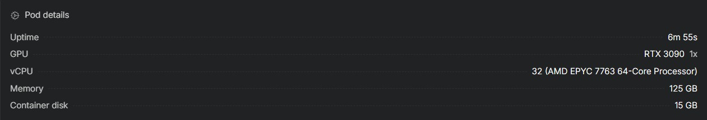
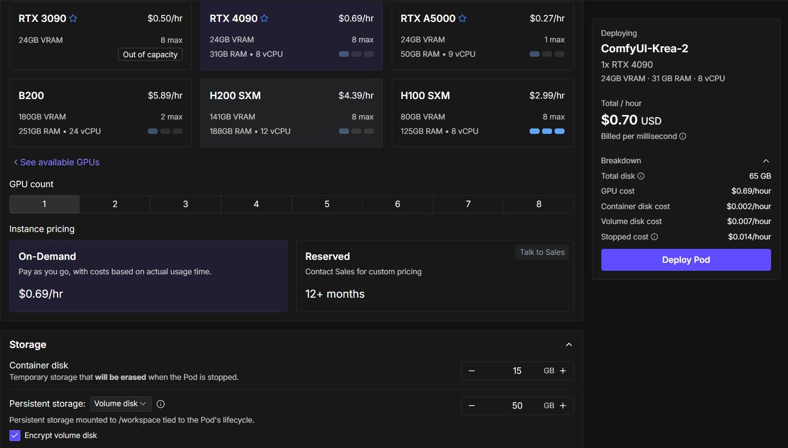
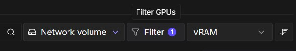
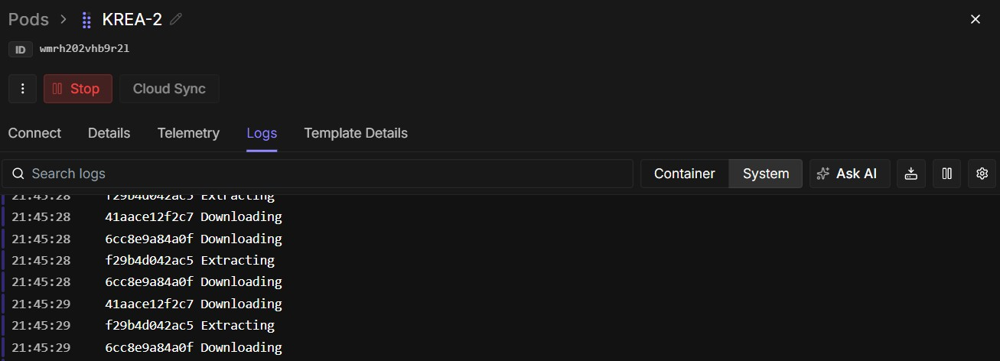
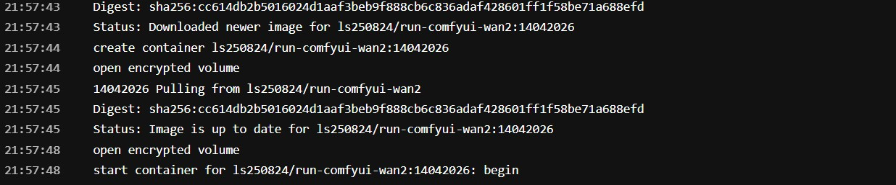
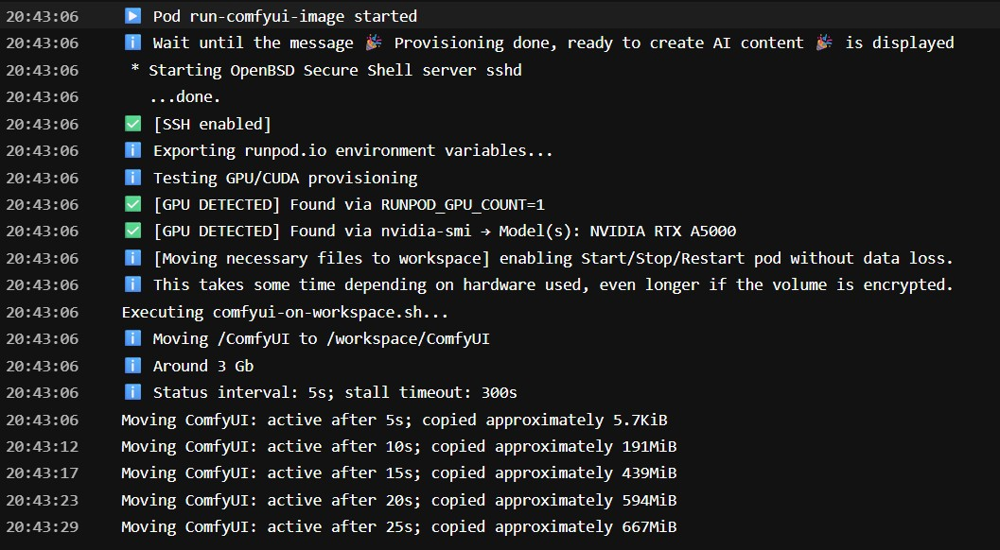
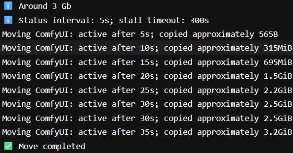
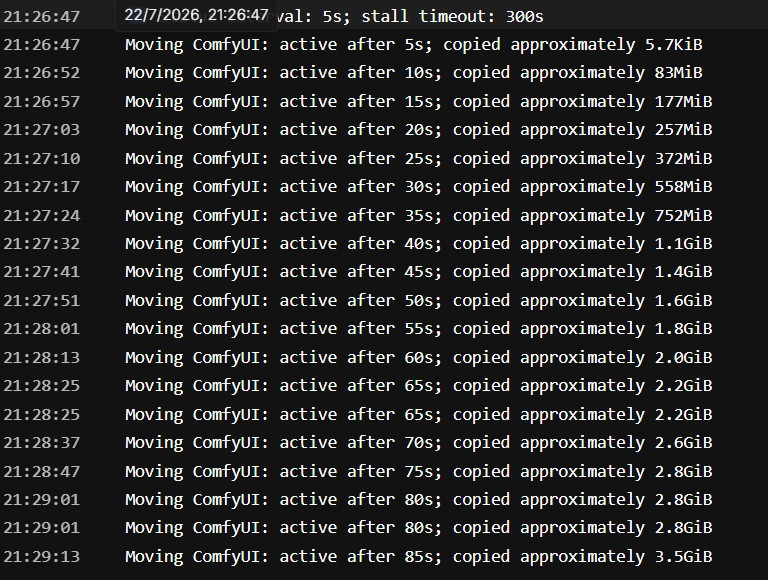
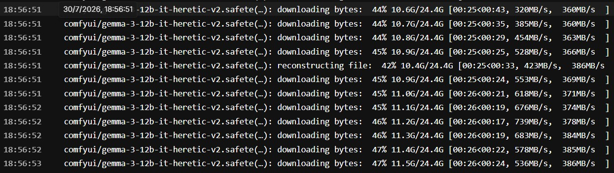

# 🚀 Starting a Pod

The containers are thoroughly tested before being used in the templates. However, deploying a pod can still be frustrating due to slow or overloaded hardware on RunPod, as well as limited network performance when connecting to Docker Hub or the Hugging Face Hub. The parameters below will help you identify and stop an underperforming pod. A fast GPU provides little benefit when the rest of the system cannot operate at a comparable speed. The screenshot above is an example of the deployment speed of an excellent performing pod running Krea-2.

## 🧩 Choose a Template

A compatible GPU is preconfigured in each RunPod template and is marked with an asterisk (*). For a more comprehensive list of compatible GPUs, refer to the model-specific hardware sections below.

### Image templates

- [View available image templates](ComfyUI_image_deployment.md#runpod-templates)
- [Compatible GPUs](ComfyUI_image_hardware.md).

### WAN templates

- [View available WAN templates](ComfyUI_WAN_deployment.md#runpod-templates)
- [Compatible GPUs](ComfyUI_WAN_hardware.md).

### LTX templates

- [View available LTX templates](ComfyUI_LTX_deployment.md#template)
- [Compatible GPUs](ComfyUI_LTX_hardware.md).

## Deploy the Pod

- The screenshow shows the New Pod deploy page (Early access features)

1. Edit the template settings if needed.
2. Choose **Volume disk** (`/workspace`).
3. Enable volume encryption if desired.
4. Click **Deploy pod**.

## ⚠️ CUDA errors when deploying the pod

- Deploy in another region.
- Change the filter to CUDA 12.8 in the RunPod console.

## 📜 Viewing System Logs

- Go to **Logs or Connect**.
- Loading and extracting takes around **4–10 minutes**, depending on the region.
- If the image does not begin downloading after **1 minute**, delete the pod and redeploy it in another region.
- If it keeps downloading without extracting after **3 minutes** delete the pod and redeploy it in another region.

The extraction ends with a message like this in the **Logs** section:

## 🐳 Viewing Container Logs

### Copy ComfyUI from container to workspace

- The time required to copy ComfyUI from the container to the workspace is a useful indicator of overall system performance. Depending on the hardware, this process typically takes between **5 and 90 seconds**. If the copy operation stalls or takes longer than **120 seconds**, consider starting another pod and comparing its performance. A slow copy operation often indicates storage or system performance issues that can also cause problems when extracting models or loading them from disk into the GPU's video memory (VRAM). 

#### Example excellent performance

#### Example acceptable/slow performance

### Downloading models form huggingface hub

- Model download speeds depend on both network and storage performance. A download speed above **200 MB/s** is considered acceptable. If a download fails, allow the startup script to finish and then restart the pod so that it can download any missing models.

### When you see the final message, your pod is ready:

## Continue with the tutorials

- [ComfyUI image tutorial](ComfyUI_image_tutorial.md#connecting-to-your-pod)
- [ComfyUI WAN tutorial](ComfyUI_WAN_tutorial.md#connecting-to-your-pod)
- [ComfyUI LTX tutorial](ComfyUI_LTX_tutorial.md#connecting-to-your-pod)
