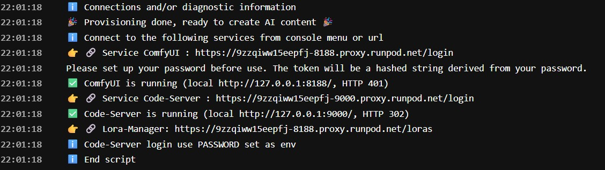

# Starting a Pod

Use this guide to choose a ComfyUI template, deploy it on RunPod and confirm that the pod starts correctly. Deployment usually takes several minutes because RunPod must download the container and the startup script may also download models from Docker Hub and the Hugging Face Hub.

If RunPod or a specific region appears unavailable, check the [RunPod status page](https://uptime.runpod.io/) before redeploying.

## Quick start

1. [Choose a template](#choose-a-template) for your workload.
2. [Select the GPU, RAM and workspace storage](#deploy-the-pod).
3. Click **Deploy Pod**.
4. [Monitor the startup checkpoints](#monitor-startup).
5. Wait for the final ready message.
6. [Open ComfyUI and continue with the tutorial](#continue-with-the-tutorial).

## Choose a template

A compatible GPU is preconfigured in each RunPod template and marked with an asterisk (*). Check the hardware guide before choosing another GPU.

| Workload | Use it for | Templates | Hardware guidance |
| --- | --- | --- | --- |
| Image | Image generation and editing | [View image templates](ComfyUI_image_deployment.md) | [Compatible GPUs](ComfyUI_image_hardware.md) |
| MiniMax H3 | Video and native-audio generation | [View MiniMax templates](ComfyUI_MiniMax_deployment.md) | [Compatible GPUs](ComfyUI_MiniMax_hardware.md) |
| WAN | Video generation and motion transfer | [View WAN templates](ComfyUI_WAN_deployment.md) | [Compatible GPUs](ComfyUI_WAN_hardware.md) |
| LTX | Video and audio generation | [View LTX templates](ComfyUI_LTX_deployment.md) | [Compatible GPUs](ComfyUI_LTX_hardware.md) |

## Deploy the pod

The screenshot shows RunPod's **New Pod** deployment page with the early-access interface enabled.

1. Choose an available **GPU**, preferably one marked with an asterisk (*).
2. Set a suitable minimum amount of **system RAM** in the filters.
3. Choose the **Volume Disk** mounted at `/workspace`.
4. Enable volume encryption if desired.
5. Click **Deploy Pod**.

<strong>View the New Pod deployment page</strong>

### Choose enough system RAM

- For image generation, allocate at least twice as much system RAM as GPU VRAM.
- For video generation, allocate at least three times as much system RAM as GPU VRAM.

For example, 60 GB of system RAM is a reasonable selection for image generation with an RTX 4090 with 24 GB of VRAM.

<strong>View the RAM filter</strong>

## Monitor startup

Open **Logs** or **Connect** after deployment. Use these checkpoints to distinguish a normal startup from an underperforming pod.

| Phase | Healthy indication | When to investigate | Recommended action |
| --- | --- | --- | --- |
| Docker download starts | Activity begins within 1 minute | No download activity after 1 minute | Try another region |
| Docker extraction starts | Extraction begins within 3 minutes | Download continues without extraction after 3 minutes | Redeploy in another region |
| Container download and extraction | Completes in approximately 4–8 minutes | Progress is stalled or unusually slow | Compare with another pod or region |
| Copy ComfyUI to `/workspace` | Completes in 0–110 seconds | Stalls or exceeds 120 seconds | Compare storage performance with another pod |
| Model download | Sustained speed above 200 MB/s is acceptable | A model download fails | Let startup finish, then restart the pod |
| Startup complete | The final ready message appears | No final message after preceding steps complete | Review the container logs |

### Docker download and extraction

RunPod first downloads and extracts the container. This normally takes approximately **4–8 minutes**, depending on the region. The extraction phase ends with a completion message in the system logs.

<strong>View a normal Docker download and extraction</strong>

<strong>Download starts</strong>

<strong>Download and extraction complete</strong>

### Container startup

After extraction, the container starts and copies ComfyUI to `/workspace`. This copy usually takes between **0 and 110 seconds**. A transfer rate of approximately **1 GB per 30 seconds** is acceptable.

<strong>View normal container startup</strong>

### Downloading models from the Hugging Face Hub

Model download speeds depend on both network and storage performance. A speed above **200 MB/s** is acceptable. If a download fails, let the startup script finish and then restart the pod so that it can download any missing models.

<strong>View normal model downloads</strong>

### Pod ready

The pod is ready when the final startup message appears in the container log.

## Examples of healthy pods

These examples show pod configurations after a successful deployment. Hardware and startup times can vary by region and host.

<strong>View successful pod examples</strong>

## Troubleshooting

Use this section when a startup checkpoint is missed. The normal deployment path above remains the quickest reference when startup is progressing as expected.

### CUDA errors during deployment

- Try another region.
- Set the CUDA filter to **CUDA 12.8** in the RunPod console.

<strong>View the CUDA filter</strong>

### Container download does not start

If the image does not begin downloading within **1 minute**, redeploy the pod in another region.

<strong>View an example with no download activity</strong>

### Container does not begin extracting

If the download continues without extraction after **3 minutes**, redeploy the pod in another region.

<strong>View a slow download without extraction</strong>

### Slow copy to the workspace

The time required to copy ComfyUI to `/workspace` is a useful indicator of storage and system performance. If the copy stalls or exceeds **120 seconds**, compare it with another pod. Slow storage can also affect model extraction and loading models into GPU memory.

<strong>Compare excellent, acceptable and poor copy performance</strong>

<strong>Excellent performance</strong>

<strong>Acceptable performance</strong>

<strong>Poor performance</strong>

## Continue with the tutorial

When the final ready message appears, [connect to your pod and open ComfyUI](ComfyUI_tutorial.md#connecting-to-your-pod).
